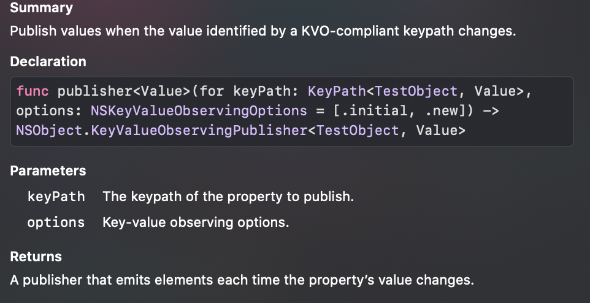

# Ch 12: Key-Value Observing


- Single variable의 변화를 observe하기 위해 Combine에서 제공하는 옵션
  - KVO에 호환되는 객체의 모든 프로퍼티에 대해 publisher를 제공함.
  - `ObservableObject` 프로토콜로 여러개의 변수의 변화될 수 있는 경우를 처리할 수 있다.


### Introducing publisher(for:options:)

- KVO는 Objective-C의 필수 컴포넌트였다. Foundation, UIKit 및 많은 클래스들의 프로퍼티가 KVO호환된다.
- KVO호환(KVO-compliant) 프로퍼티에 대해 observe하는것은 쉽다.
- 아래는 OperationQueue를 사용한 예제.
  - 큐에 새로운 operation을 추가할 때마다 operationCount가 증가하고 sink하는 곳에서 그 값을 받게된다. 큐가 operation을 consume하게 되면 다시 감소하고 sink하는 곳에서 업데이트된 count 값을 받을 수 있다.

```swift
let queue = OperationQueue()

let subscription = queue.publisher(for: \.operationCount)
    .sink { print("Outstanding operations in queue: \($0)")
}
```

- KVO호환 프로퍼티를 갖고 있는 다른 프레임워크들의 클래스들이 많이 있다. 관찰할 프로퍼티의 keypath와 함께 publisher(for:)를 사용해서 관찰할 수 있다. 


### Preparing and subscribing to your own KVO-compliant properties

- 다음과 같은 경우 Key-Value Observing 을 사용할 수 있습니다.
  - 객체가 class타입이고(not structs) NSObject를 상속받은 경우
  - 프로퍼티를 관찰가능하도록 만들기 위해 `@objc` dynamic attribute를 표시한 경우
- 이렇게 하게 되면 객체와 프로퍼티가 KVO-compliant하게 되고 Combine을 통해 관찰 가능하게 된다.

>  Note: Swift 언어는 KVO를 직접 지원하지 않지만 속성을 @objc로 표시하면 컴파일러가 강제로 솜겨진 메서드를 생성합니다. 이런 매커니즘을 이 책에서 설명하진 않겠습니다. NSObject protocol로부터 특정 메서드에 크게 의존한다고만 여기서 말하겠습니다. 이것은 왜 너의 객체가 NSObject를 상속해야하는지를 설명합니다.


```swift
// 1
class TestObject: NSObject {
  // 2
  @objc dynamic var integerProperty: Int = 0
}
let obj = TestObject()
// 3
let subscription = obj.publisher(for: \.integerProperty) 
	.sink {
    print("integerProperty changes to \($0)")
  }
// 4
obj.integerProperty = 100
obj.integerProperty = 200

// Output: 0, 100, 200
```

1. NSObject 프로토콜을 상속받은 클래스를 생성한다. (KVO를 위해 요구되는 사항)
2. `@objc` 다이나믹 속성을 표시한다. (Observable을 만들기 위함).
3. publisher를 생성하고 구독한다.
4. 변화 시작

> Swift의 Int타입을 쓰면서 Objective-C의 기능인 KVO를 사용하는데 잘 작동하는것을 볼 수 있다. KVO는 모든 Objective-C 과 Swift타입의 브릿징된 타입에서 잘 동작하기 때문이다. 여기엔 모든 기본 Swift타입과 배열 및 딕셔너리도 포함됩니다.


### Observation options

- publisher(for:options:)의 옵션파라미터는
  - .initial, .prior, .old, .new 네 가지 값이 있다. 기본값은 .initial이므로 변경사항을 내보내기전에 초기값을 sink로 흘려준다.
  - 
- 옵션들은 다음과 같다.
  - `.initial` : emits the intial value
  - `.prior` : emits both the previous and the enw value when a chnage occurs.(이전값과 변경된값 전부)
  - `.old`, `.new`: unused in this publisher, they both do nothing(just let the new value through)
- 초기값조차 필요없다고 하면 아래와 같이 사용하면 된다.

```swift
obj.publisher(for: \.stringProperty, options: [])
```


### ObservableObject

- Combine의 ObservableObject 프로토콜은 Swift객체에서도 동작한다.(NSObject를 상속받지 않은 타입이여도)
- `@Published` 프로퍼티 래퍼와 팀을 이루어 컴파일러에서 생성된  `objectWillChange` 퍼블리셔를 사용하여 클래스를 만들 수 있다.
- 아래와 같이 사용하면된다.
- 예제

```swift
class MonitorObject: ObservableObject {
  @Published var someProperty = false
  @Published var someOtherProperty = ""
}
let object = MonitorObject()
let subscription = object.objectWillChange
	.sink {
  	print("object will change")
}
object.someProperty = true object.someOtherProperty = "Hello world"
```

- `ObservableObject` 프로토콜의 준수는 컴파일러가 자동으로 `objectWillChange` 프로퍼티를 생성하게 해준다. 타입은`ObservableObjectPublisher` 이고 Void 타입의 아이템을 방출하고, Never fails이다.
- `@Published`변수 중 하나가 변경될 때마다 매번 `objectWillChange`가 동작할거다. 불행하게도 어떤 프로퍼티가 실제로 변화됐는지는 알 수 없다. 이것은 이벤트를 통합해서 화면 업데이트를 간소화하는 SwiftUI와 궁합이 좋게 설계되었다.


### Key Points

- Key-Value Observing은 Objective-C 런타임과 NSObject protocol에 의존한다.
- 많은 Objective-C 클래스가 KVO-compliant 프로퍼티를 제공한다.
- 자신만의 프로퍼티를 관찰하고 싶다면, `NSObjecy`의 상속솨 `@objc` dynamic attribute를 활용하면 된다.
- `ObservableObject`를 프로토콜과 `@Published`프로퍼티를 사용하면 된다. 컴파일러가 `objectWillChange` 생성하고 @published의 프로퍼티의 변화에 따라서 objectWillChange가 흐르게 될것임.


#### Discussion

- 무스뜻인지? While the Swift language doesn’t directly support KVO, marking your properties @objc dynamic forces the compiler to generate hidden methods that trigger the KVO machinery. Describing this machinery is out of the scope of this book. Suffice to say the machinery heavily relies on specific methods from the NSObject protocol, which explains why your objects need to inherit from it.
  -  Note: Swift 언어는 KVO를 직접 지원하지 않지만 속성을 @objc로 표시하면 컴파일러가 강제로 솜겨진 메서드를 생성합니다. 이런 매커니즘을 이 책에서 설명하진 않겠습니다. NSObject protocol로부터 특정 메서드에 크게 의존한다고만 여기서 말하겠습니다. 이것은 왜 너의 객체가 NSObject를 상속해야하는지를 설명합니다.

