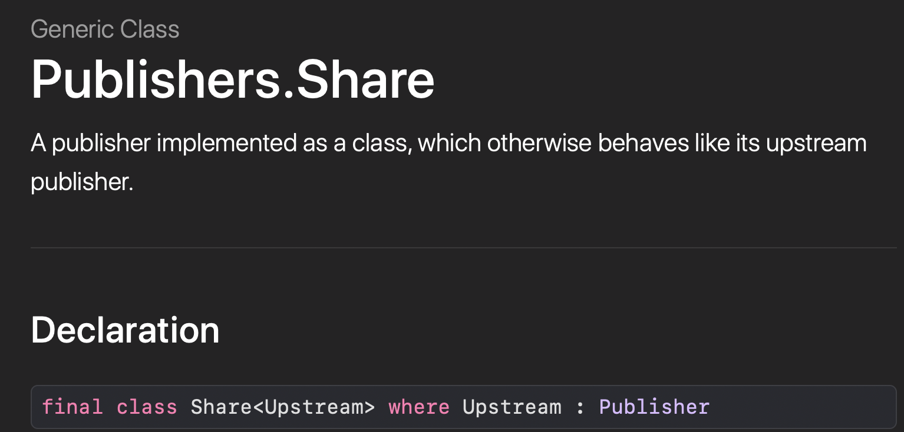
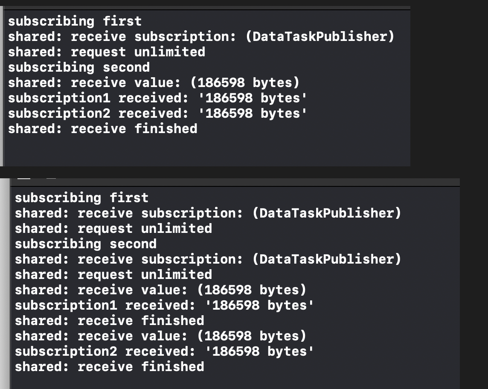

# Ch 13: Resource Management


- 리소스를 구독자들끼리 공유하는 방법
- Combine은 리소스 관리에 대해 2가지 오퍼레이터를 제공한다.
  - `share()`
  - `multicast(_:)`


### The share() operator

- share 오퍼레이터의 목적은 publisher를 by value가 아닌 by reference로 얻는것이다.
- Publisher는 보통 struct다. publisher를 function에 넘기거나 프로퍼티에 저장할 때, Swift는 복사를 한다. 각각의 복사본을 구독하게 되고 publisher는 한가지 작업만 수행할 수 있게 된다. 
- (When you subscribe to each of the copies, the publisher can only do one thing: Start the work it’s designed to do and deliver the values.)

- share오퍼레이터는 `Publisher.Share`클래스의 인스턴스를 반환한다. 이 퍼블리셔는 upstream의 퍼블리셔를 share한다. share는 upstream을 한번만 구독한다. 그런 다음 업스트림 퍼블리셔로부터 받은 값을 이후 구독자들에게 다시 이 값을 릴레이 한다.(It will subscribe to the upstream publisher once, with the first incoming subscriber. It will then relay the values it receives from the upstream publisher to this subscriber and to all those that subscribe after it.)
- 


> Note: 새로운 구독자들은 upstream publisher가 값을 방출할 때만 값을 받는다. There's no buffering or replay involved. 만약에 share된 퍼블리셔가 Complete돼고 그 이후에 구독을하면 그 이후 구독자는 completion event만 받게 된다.

- 이 개념을 연습하기 위해서 9장을 상기시켜보자.

```swift
let shared = URLSession.shared
	.dataTaskPublisher(for: URL(string: "https://www.raywenderlich.com")!) 
	.map(\.data)
	.print("shared")
	.share()

print("subscribing first")

let subscription1 = shared.sink( receiveCompletion: { _ in },
  receiveValue: { print("subscription1 received: '\($0)'") }
)

print("subscribing second")

let subscription2 = shared.sink( receiveCompletion: { _ in },
  receiveValue: { print("subscription2 received: '\($0)'") }
)

// Output
subscribing first
shared: receive subscription: (DataTaskPublisher)
shared: request unlimited
subscribing second
shared: receive value: (186598 bytes)
subscription1 received: '186598 bytes'
subscription2 received: '186598 bytes'
shared: receive finished

```

- 첫번째 구독자는 "작업"(여기선 네트워크 호출)을 트리거 한다. 이후에 두번째 구독자는 단순히 'connet'하고 첫번째와 동시에 값을 받는다.
- share()를 걸었을 때와의 차이 (DateTaskPublisher가 share되지 않으면 두번의 subscription을 받게 되어 있다. 이런 경우 request가 두번 된다.



- 하지만 만약에 두번째 구독자가 request가 완료된 후에 구독을 하게 되면 어떻게 될까? 
- 아래와 같이 구독을 딜레이시켜서 확인해보면 된다.
  - 결과는 subscription2는 값을 받지 못하고 completion만 받게된다.

```swift
var subscription2: AnyCancellable? = nil 
DispatchQueue.main.asyncAfter(deadline: .now() + 5) {
  print("subscribing second")
subscription2 = shared.sink(
receiveCompletion: { print("subscription2 completion \($0)")
},
    receiveValue: { print("subscription2 received: '\($0)'") }
) }
```

- 그럼 어떻게 2개의 subscription에 대해서 request result를 받을 수 있을까?


### The multicast(_: ) operator

- single subscription을 publisher에 공유하고, upstream publisher가 완료된 후에도 새로운 구독자에게 value를 replay해서 받게 하기 위해선 `shareReplay()`같은 오퍼레이터같은 것이 필요하다. 불행하게도 이런연산자는 Combine의 영역이 아니다. 하지만 ch18에서 Custom Publishers and Handling Backpressure에 대해서 어떻게 이것을 생성하는지 배우게 될것이다.
- 챕터9 'Networking'에서 `multicast`를 사용했었다. 이 오퍼레이터는 share()를 기반으로 만들어졌고. 선택한 Subject를 사용해서 subscriber에게 값을 publish한다.
- `multicast`의 독특한 특징은 multicast가 방출하는 publisher는 `ConnectablePublisher`라는 점이다. 이것은 `connect()`를 호출하기 전까지는 upstream의 publisher를 구독하지 않겠다는 의미다. (connect전까지 구독을 미룰 수 있다.)
- example

```swift

// 1. upstream의 publisher emit을 relay하기 위한 subject wnsql.
let subject = PassthroughSubject<Data, URLError>()

// 2. Prepare the multicasted publisher, using above subject.
let multicasted = URLSession.shared
    .dataTaskPublisher(for: URL(string: "https://www.raywenderlich.com")!)
    .map(\.data)
    .print("shared")
    .multicast(subject: subject)

// 3. subscribe to the shared(multicasted)
let subscription1 = multicasted
    .sink(receiveCompletion: { _ in },
          receiveValue: { print("subscription1 received: '\($0)'") }
)

let subscription2 = multicasted
    .sink(receiveCompletion: { _ in },
          receiveValue: { print("subscription2 received: '\($0)'")}
)

// 4. instructs the publisher to connect to the upstream publisher
multicasted.connect()

// 5
subject.send(Data())

// Output
subscribing first
shared: receive subscription: (DataTaskPublisher)
shared: request unlimited
subscription1 received: '0 bytes'
subscription2 received: '0 bytes'
shared: receive cancel

```


> Note: `autoconnect()` 를 사용하면 유용한 시나리오 : upstream publisher가 single value를 방출하고 `CurrentValueSubject`를 사용해서 subscriber를 통해 share를 할 때.

- 네트워킹과 같은 resource-heavy processes에 유용한 Sharing subscription.


### Future

- share와 multicast말고 계산 결과를 공유할 수 있는 또 다른 방법: `future`
- `Promise`를 argument로 받는 클로저를 전달해서 `Future`를 생성할 수 있다. 
- success 또는 failure의 결과가 available할 때마다 promise를 fulfill(이행)한다.
- 메모리를 refresh하는 예제를 살펴보자.

```swift
// Simple synchronous example
// perform some work and immediately fulfills the promise with the result of a computation,
// or with the thrown error in case of failure.
let future = Future<Int, Error> { fulfill in
  do {
    let result = try performSomeWork()
    fulfill(.success(result)) 
  } catch {
    fulfill(.failure(error)) }
}
```

- `Future`는 클래스다.
- Future가 생성되는 즉시 computating the result를 시작하고, 최대한 빨리 fulfill the promise as soon as possible.
- fullfilled `Promise`의 결과를 저장하고 **current and future**의 subscriber에게 전달한다.

- Future 또한 single result에 대한 share를 하기 위한 좋은 방법 중 하나다.

> Note: Future를 구독하지 않아도 Future를 만들면 클로저를 호출하고 작업을 수행한다. You cannot rely on Deffered to defer closure execution until a subscriber comes in, becuz Deferred is a struct and would cause a new Future to be created every time there is a new subsriber! (새로운 subscriber가 있을 때마다 Future가 새로 만들어지기 때문에 subscriber가 올때까지 클로저 실행을 미루기 위해 Deffered를 의존할 수 없다.)
>
> ...좀 이해 안가는 문장...

