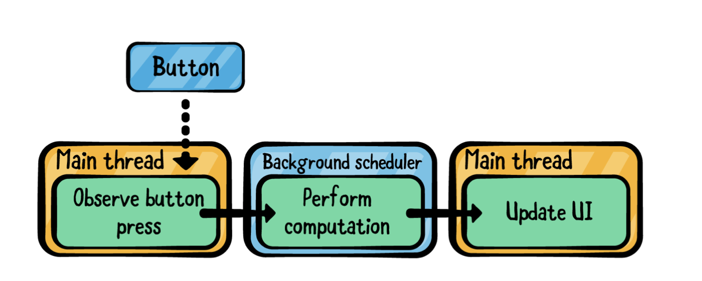
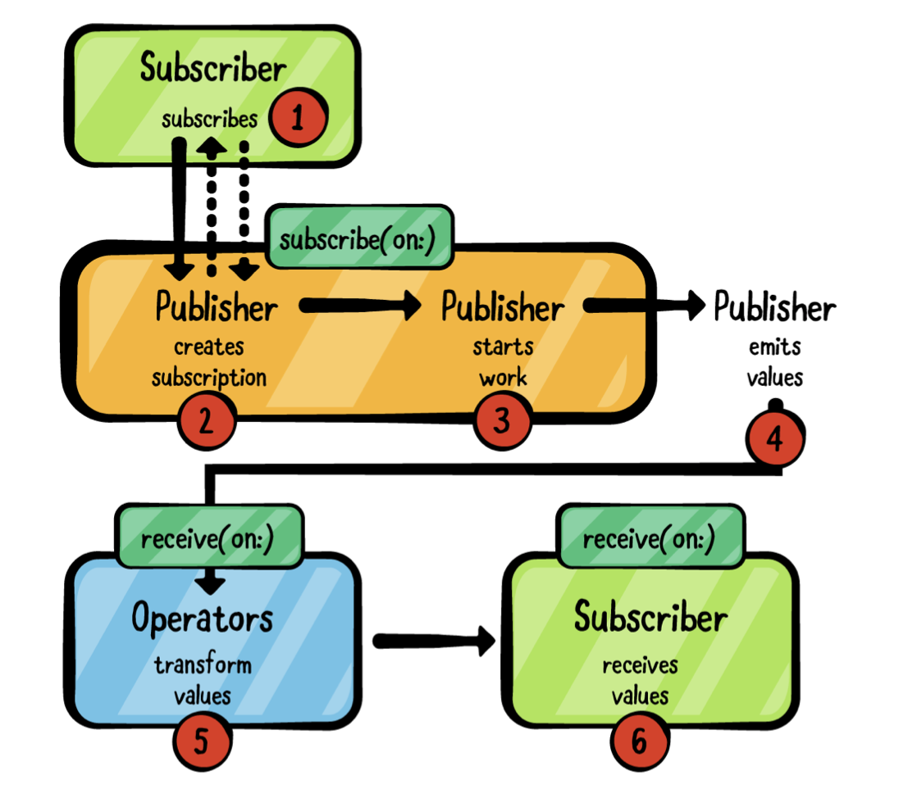

# Ch 17: Schedulers

### An introduction to schedulers

- **Scheduler**는 언제 어떻게 클로저를 실행해야되는지에 대해 정의되어 있는 프로토콜.
- 코드가 어떤 스레드에서 실행될지에 대한 세부사항은 어떤 스케쥴러를 고르냐에 달려있다.
- **스케줄러는 스레드와 같은게 아니다.**
- 아래 그림에서 스케쥴러의 개념이 foreground/background의 개념과 어떻게 연관되어 있는지 알려준다. 구현에 따라 작업이 **serialized** 하거나 **parallelized** 하게 될 수 있다. (직렬과 병렬)

- 스케쥴러를 완벽하게 이해하기 **Scheduler** 프로토콜을 conform하는 클래스를 확인해야합니다.
- 일단은 스케쥴러와 관련된 오퍼레이터를 살펴봅시다.

### Operators for scheduling

- `subscribe(on:)` , `subscribe(on:options:)` 는 특정 스케쥴러에서 subscription을 생성합니다. (create the subscription)
- `receive(on:)` , `receive(on:options:)` 은 특정 스케쥴러에서 값을 전달합니다. (deliver values)

- 이 외에도, `debounce, delay, measureInterval, throttle, timeout` 이 챕터6에서 스케쥴러와 스케쥴러 옵션을 파라미터로 받도록 되어있었다.

### Introducing subscribe(on:)

- publisher는 구독이 있기 전까지 아무의미가 없다. 하지만 publisher를 구독하게 되는 순간 어떤 일들이 일어날까?

1. Publisher가 subscriber를 받고 `Subscription`을 생성함.
2. Subscriber가 subscription을 받고 publisher로부터 values를 요청함.(그림에서 점선으로 표시된)
3. Publisher starts work (via the subscription)
4. Publisher emits value (via the subscription)
5. `Operator`가 value를 trasnform함
6. Subscriber가 마지막으로 value를 받음.

- 1,2,3은 publisher를 구독한 현재 스레드에서 실행된다.
- 하지만 `subscribe(on:)`오퍼레이터를 사용하면, 이런 모든 operations들이 지정된 스케쥴러에서 실행된다.

> `receive(on:)` 볼 때 위의 다이어그램 다시 활용할거임.

- **Starter.playground**의 subcribeOn-receiveOn 예제
  - 예제 핵심: `subscribe(on:)` 을 써서 sink 클로저의 스레드가 다른 것을 확인.

> DispatchQueue의 동적 스레드 관리 특성으로 인해서 예제를 실행할 때마다 항상 같은 스레드 넘버가 나오않을 수 있다. 중요한 점은 스레드 넘버가 같은지를 확인하면 되는 것.

### Introducing receive(on:)

- 앞 예제에서 sink앞에  `.receive(on: DispatchQueue.main)`를 붙여주면 다시 sink클로저가 메인에서 실행된걸 확인할 수 있음.

> **Note**: You may see the second message (“ExpensiveComputation subscriber received...”) on a different thread than the two next steps. Due to internal plumbing in Combine, this step and the next may execute asynchronously on the same queue. Since Dispatch dynamically manages its thread pool, you may see a different thread number for this line and the next, but you won’t see thread 1.

### Scheduler implementations

- 애플에서 제공하는 Scheduler 프로토콜을 채택하는 구체적인 구현을 몇 가지 제공함.
  - **ImmediateScheduler** : 현재 스레드에서 코드를 즉시 실행하는 심플한 스케쥴러(subscribe(on:)이나 receive(on:)와 같은 오퍼레이터로 스케쥴러를 변경하지 않는 한.) -> Q. 굳이 왜 써야할까? 언제쓸까?
  - **RunLoop** : Tied to Foundation's Thread object. (안써봄..)
  - **DispatchQueue**: Serial과 concurrent 다 쓸 수 있음
  - **OperationQueue**: 작업 항목(work items)의 실행을 관리하는 큐

> `TestScheduler`의 설명은 생략.

위의 스케쥴러를 하나씩 살펴보자

#### ImmediateScheduler

- Combine 프레임워크에서 제공하는 가장 간단한 스케쥴러.
- `recordThread(using:)` : thread를 기록하는 오퍼레이터. 연산자가 값을 전달할 현재 스레드를 기록하고, publisher소스에서 final sink까지 여러번 기록할 수 있다.

> `recordThread(using:)`은 테스트 목적의 오퍼레이터입니다. data의 타입을 internal value 타입으로 바꾸는. 이 오퍼레이터에 대한 자세한 구현은 이번 챕터의 범주가 아니므로 다루지 않는다.

- 예제

#### ImmediateScheduler options

- `Never` : should never pass a value for the `options` parameter of the operator.

#### ImmediateScheduler pitfalls

- delay를 가진 initailizer가 없음.

### RunLoop scheduler

- Main (UI) thread를 포함한 input sources를 thread level에서 관리하는 방법.
- 여전히 애플리케이션의 메인스레드는 RunLoop와 연관이 있다.
- Foundation Thread를 현재스레드에서 `RunLoop.current`를 호출함으로써 얻을 수 있다.

> 요즘은 RunLoop가 별로 유용한 클래스가 아니다. DispatchQueue가 대부분 상황에서 합리적인 선택이다. 이 얘기는 특정 케이스에 대해서 run loop가 유용하다는 얘기다. 예를 들면 `Timer` 스케쥴러는 RunLoop에서 든다. UIKit과 AppKit은 다양한 유저 입력을 처리하기 위해서 RunLoop와 실행모드(execution modes)를 사용한다. 하지만 이책에서는 RunLoop에 대해서 설명하지 않음.

- RunLoop 예제
  - 메인스레드에서 ThreadRecorderView를 호출, ThreadRecorderView에 의해 호출된 클로저가  메인. RunLoop.current는 메인스레드의 RunLoop.
  - receive(on:) 대신 `subscribe(on: DispatchQueue.global())`을 사용할 경우 한 개의 스레드에서만 동작.
    - publisher가 concurrent queue에서 구독되었지만 `Timer`는 메인스레드에서 값을 방출하므로. subscribe하는 스케쥴러를 바꿔도 항상 main thread.

#### Scheduling code execution with RunLoop

- RunLoop가 ImmediateScheduler랑 다른 점 : 바로 실행가능한거 + **defer execution**을 할 수 있다.
- RunLoop가 옵션으로 `Date`값을 받는다.
- ...아래 내용은 잘읽히지 않아서 일단 패스..

#### RunLoop options

#### RunLoop pitfalls

- RunLoop의 사용은 메인스레드의 런루프로 ㅈ한되야 하고, Foundation thread에서 RunLoop를 사요가능한 RunLoop로. Thread객체를 사해야함
- DispatchQueue에서 실행되는 코드에서 RunLoop.current를 사용하지 말것. DispatchQueue 스레드는 일시적(ephmeral)이므로 RunLoop를 사용하는 것이 거의 불가능하다. -> 과거 챕터들에서 나왔던 애기 같은데..다시 앞내용을 보고 생각해보기..

### DispatchQueue scheduler

- Dispatch framework is powerful component of Foundation that allows you to **execute code concurrently on multicore hardware by submitting work to dispatch queues managed by the system.**
- DispatchQueue는 **serial(default)**와 **concurrent**모두 가능. 
  - **A serial queue**: 일반적으로 작업이 겹치지 않는 다는 것을 보장한다. 같은 큐에서의 모든 작업들이 일어난다고 해도 locking없이 resources를 공유할 수 있다.
  - **A concurrent queue**: 가능한 많은 operation들을 concurrently하게 처리한다. pure computation에 적합하다.

#### Queues and threads

- serial, concurrent의 모든 큐는 시스템에서 관리하는 스레드 풀에서 코드를 실행한다.
- queue에서 실행되는 코드는 현재 스레드에서 실행된다는 가정을 하면 안된다.
- DispatchQueue가 스레드를 관리하는 방식 때문에 RunLoop.current를 사용해서 작업하면 안된다.

- `subscribe(on:)`과 `receive(on:)`이나 다른 Shcheduler를 파라미터로 받는 오퍼레이터들을 사용할 때, 항상 같은 스레드라고 가정하면 안된다.

#### Using DispatchQueue as a scheduler

- 예제 코드
- Timer대신 DispatchQueue의 `schedule()`메서드를 이용하면 repeating 가능.

- `receive(on:)`의 경우, **work item**은 현재 스케줄러에서 다른 스케쥴러로 hop(홉)되는 값입니다. Q.홉이 무슨말?

#### DispatchQueue options

- QoS(Quality of Service)
- 대부분의 상황에서 잘 사용되진 않음.
- qos 변경하는 옵션 예제 (각 QoS에 대한 간략한 설명)

### OperationQueue

- 이 시스템 클래스는 작업실행을 관리하는 대기열로 정의되어 있습니다.
- 종속성이 있는 작업을 생성하고 관리하는 메커니즘을 제공한다.
- Combine에선 이러한 메커니즘을 사용하진 않는다.
  - 왜? OperationQueue는 내부적으로 Disppatch를 사용한다. (표면적으로 거의 차이가 없긴하다.)
- 예제코드.
- `maxConcurrentOperationCount` 파라미터
  - 디폴트는 시스템에서 정의한 숫자로, OperationQueue가 다수의 operation을 동시에 실행할 수 있다.
  - Publisher가 거의 동시에 모든 항목을 emit하므로 Dispatch의 concurrent 큐를 통해 여러 스레드로 dispatch된다.

#### OperationQueue options

- 옵션 없음.

#### OperationQueue pitfalls

- OperationQueue는 기본적으로 concurrent DispatchQueue와 동일하게 돌아간다. 그러나 publisher가 value를 방출할 때 마다 수행해야할 중요한 작업이 있다면 maxConcurrentOperationCount를 매개변수로 해서 조정가능하다.
- 