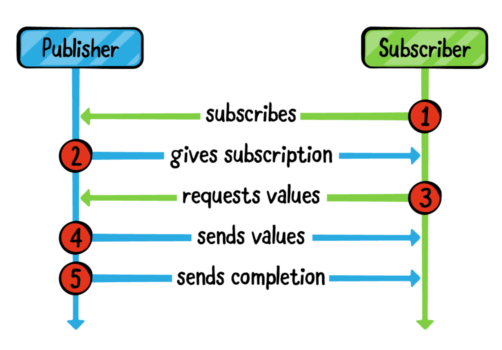
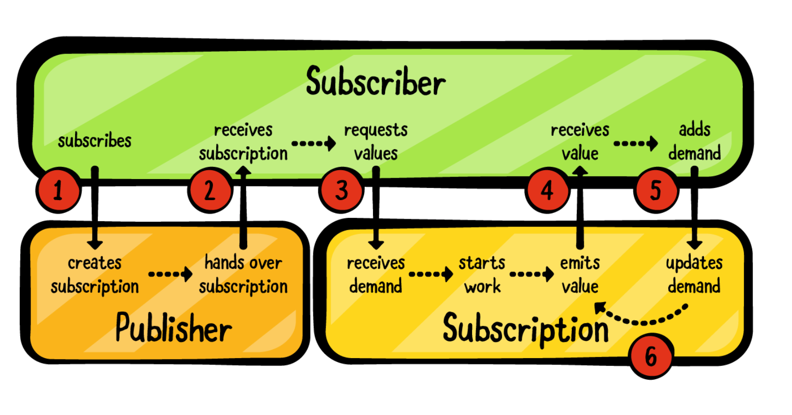

# Ch 18: Custom Publishers & Handling Backpressure


- 무슨농담일까요? “What is this backpressure thing? Is that some kind of back pain induced by too much leaning over your chair, scrutinizing Combine code? ”


#### Creating your own publishers

- own publisher를 만들기 위해 살펴볼 3가지 방법
  1. Publisher 네임스페이스안에서 간단한 extension 사용
  2. Subscription(produces values) 을 사용해서 Publishe 네임스페이스 안에서 새로운 타입을 정의한다.
  3. 위와 유사한 방법으로 Subscription(transform values from an upstream publisher)을 가지고 새로운 타입을 정의한다.
     - 차이: 값을 생성하는 subscription이냐, 업스트림으로부터 값을 변형하는 subscription이냐.


> Note: 기술적으로 custom subscription없이 커스텀 publisher를 만드는것은 가능하다. 만약에 이렇게 만들게 되면, subscriber의 요구에 대응하기 어려울 수 있다.(which makes your publisher illegal in the Combine ecosystem.) 빠른 cancellation(early cancellation)도 문제가 될 수 있다. 이런 접근법은 추천하지 않는다. 이번챕터에서 어떻게 publisher를 올바르게 작성하는지 배우게 될 것이다.


#### Publishers as extension methods

- 첫번째 할 일은 이미 존재하는 오퍼레이터들을 사용해서 간단한 오퍼레이터를 구현하는 것이다. 
- `unwrap()`오퍼레이터를 추가다고 생각해보자.(unwrap은 옵셔널 밸류를 unwrap하고 nil을 무시하는 오퍼레이터다)

```swift
extension Publisher {
    func unwrap<T>() -> Publishers.CompactMap<Self, T> where Output == Optional<T> {
        compactMap { $0 }
    }
}

```

- `Publishers.CompactMap`은 제네릭 타입이다. (`CompactMap<Upstream, Output>`)
  - 정의를 보면 알 수 있음. (struct로 되어있음)
  - `Upstream`이 `Self`고 `Output`은 wrapped type이다.
  - 마지막으로 Optional 타입이라는 제약을 걸어준다.
  - 이제 완성된 오퍼레이터를 랩핑된 타입 T에 사용하면 됨.

> 더 복잡한 오퍼레이터를 메서드로 만들 때(such as when using a chain of operators), 서명이 더 빠르게 복잡해 질 수 있다.(?)무슨말이지.. (the signature can quickly become very complicated.) -> 여기서 말하는 시그니쳐는 호출부의 모양을 말하는 것일까요?
>
> 복잡해지는 것을 해결하기 위한 좋은 테크닉은 오퍼레이터의 리턴타입을 AnyPublisher<Output, FailureType>으로 만드는 것이다. 결국 publisher를 반환하게 될것이고 type-erase the signature을 하기 위해 `eraseToAnyPublisher()`로 끝나게 될것이다.


#### Testing your custom operator

```swift
let values: [Int?] = [1, 2, nil, 3, nil, 4]

values.publisher
    .unwrap()
    .sink {
        print("Received value: \($0)")
    }

/*
Received value: 1
Received value: 2
Received value: 3
Received value: 4
*/
```

- publisher를 두가지 그룹으로 나눌 수 있다.
  - "producers"로 동작하는 Publisher, 직접(directly) 값을 제공한다.
  - "transformers"로 동작하는 Publisher, upstream으로부터 제공된 값을 transforming 한다.
- 이번 챕터에서 이 두 가지를 어떻게 사용하는지에 대해서 배우게 된다. 하지만 그 전에 publisher를 구독하게 되었을 때 내부적으로 어떤 일이 일어나는 지에 대한 이해가 필요하다.


#### The subscription mechanism

- Subscription은 Combine의 이름없는 영웅입니다.(?)
  - publisher를 구독할 때, `subscription`을 인스턴스화한다. subscription은 subscriber로부터 요청을 받고 이벤트를 생성한다. (for example, values and completion)



(2장에서 배웠던 다이어그램과 각 단계에서 호출하는 메서드를 참고하면 이해하기 좋음)




1. subscriber가 publisher를 **구독(subscribe)** 한다.
2. Publisher가 **Subscription**을 생성하고 subscriber에게 subscription을 준다. (calling `receive(subscription:)`) , (subscriber가 subscription을 받는다.)
3. subscriber가 subscription으로부터 value를 요청한다.  원하는 value가 몇개 인지 요구한다.(by sending it the number of values it wants) == subscription의 `request(_:)` 메서드를 호출한다.
4. subscription은 작업을 시작하고 값을 방출하기 시작한다. 하나씩 방출된 값들을 subscriber에게 보낸다. (subscriber의 `receive(_:)` 메서드를 호출한다.)
5. value를 받으면 subscriber는 새로운 `Subscriber.Demand`를 방출한다. (이전 total demand에 추가된다.)
6. subscription은 요청한 total number에 도달할 때까지 value를 계속 보낸다.


- 만약에 subscription이 subscriber가 요구한 만큼의 많은 value를 보냈다면 value를 더 보내기전에 새로운 demand request를 기다려야 한다.
- Q. 아래 문장 좀 어렵네요.
- 이런 메커니즘을 우회하면서 값을 계속 보낼 수 있지만, 그렇게 하게 되면 subscriber와 subscription의 계약을 깨지게 된다. 뿐만 아니라 Apple의 정에 따라 Publisher tree에서 정의되지 않은 동작이 발생할 수 있다.
  - You can bypass this mechanism and keep sending values, but that breaks the contract between the subscriber and the subscription and can cause undefined behavior in your publisher tree based on Apple's definition.
- 만약에 subscription의 value source가 complete되거나 에러가 발생하면 subscription은 subscriber의 `receive(completion:)` 메서드를 호출하게 된다.


#### Publisher emitting values

- 챕터 11 Timers에서 `Timer.publish()`를 배웠지만 타이머에 Dispatch Queue를 사용하는 것이 불편하다는 것을 알았다. 디스패치의 **DispatchSourceTimer**를 기반으로 자신만의 타이머를 만들어보는건 어떤가요. 그렇게 하기 위해서 `Subscription` 메커니즘에 대한 세부정보를 확인면 됩니다. (문장이 이해가 잘 안가네요..)

```swift
struct DispatchTimerConfiguration {
    // 1
    let queue: DispatchQueue?
    // 2
    let interval: DispatchTimeInterval
    // 3
    let leeway: DispatchTimeInterval
    // 4
    let times: Subscribers.Demand
}
```

1. 타이머가 특정 큐에서 시작하기 위함. 큐를 신경쓰고 싶지 않은 경우를 대비해 옵셔널로 선언. 이 경우엔 선택된 큐에서 시작.
2. 구독시점으로부터 타이머가 시작되는 간격

3. 시스템이 타이머의 이벤트를 지연시킬 수 있는 시간이 있는데 이 지연가능한 시간의 최대 시간을 leeway라고 함.
4. 받고자 하는 타이머 이벤트의 수. 지금은 custom 타이머를 만드는 중이므로 완료하기 전에 유연하고 제한된 수의 이벤트를 전달할 수 있다.


#### Adding the DispatchTimer publisher

- `DispatchTimer` publisher를 생성함으로써 시작할 수 있다. 모든 작업들이 subscription안에서 일어나기 때문에 매우 직관적일것이다.

```swift
extension Publishers {
    struct DispatchTimer: Publisher {
        // 5
        typealias Output = DispatchTime
        typealias Failure = Never
        
        // 6
        let configuration: DispatchTimerConfiguration
        
        init(configuration: DispatchTimerConfiguration) {
            self.configuration = configuration
        }
    }
}
```

5. 현재 시간을 `DispatchTime` value로 방출한다. 물론 절대 실패하지 않는다. (Failure type is Never.)
6. 주어진 configuration의 복사본을 유지한다. 지금 당장은 사용하지 않을 거고 뒤에서 subscriber를 받을 때 사용할 거임.

> Note: 이 코드를 작성할 때 컴파일러 에러가 날것이다. 아직 작성하지 않은 구현부에 대해서.

```swift
// 7
func receive<S>(subscriber: S) where S : Subscriber, Self.Failure == S.Failure, Self.Output == S.Input {
  // 8
  let subscription = DispatchTimerSubscription(
    subscriber: subscriber,
    configuration: configuration
  )
  // 9
  subscriber.receive(subscription: subscription)
}
```

7. function은 제네릭이다. subscriber타입에 매치하기 위해 compile-time specialization가 필요하다.
8. `DispatchTimerSubscription`내에서 발생할 bulk action. `DispatchTimerSubscription`은 곧 작성할 것.
9. 챕터2에서 배웠던 것. subscriber는 subscription을 수신한다. 그리고 이를 통해 value에 대한 request를 보낼 수 있다.


#### Building your subscription

- subscription의 역할
  - subscriber로부터 최초 요구를 받아들인다. (accept the initial demand)
  - 요구에 따른 timer event 생성
  - subscriber가 value를 받고 demand를 반환할 때마다 demand count에 추가한다. 
  - configuration에서 요청한 값보다 많은 값을 제공하지 않아야 한다. 

- Subscription을 만들어보자

```swift
private final class DispatchTimerSubscription<S: Subscriber>
	: Subscription where S.Input == DispatchTime {
 }
```

- 이 시그니쳐가 주는 정보들
  - 이 subscription은 밖으로 보이지 않고. Subscription 프로토콜을 통해서만 접근할 수 있다. `private`
  - 참조를 넘겨주기 위해 class 타입으로 선언. subscriber는 Cancellable collection을 추가할 수 있을 뿐만 아니라 `cancel()`을 독립적으로 호출할 수 있다. (cancel()호출이나 Cancellable bag 같은걸 추가할 수 있다는 뜻)
  - input value의 타입이 DispatchTime인 subscriber에게 이 subscription이 방출하는 value를 제공한다.


#### Adding required properties to your subscription

```swift
private final class DispatchTimerSubscription<S: Subscriber>: Subscription where S.Input == DispatchTime {
  // 10
  let configuration: DispatchTimerConfiguration
  // 11
  var times: Subscribers.Demand
  // 12
  var requested: Subscribers.Demand = .none
  // 13
  var source: DispatchSourceTimer? = nil
  // 14
  var subscriber: S?
}
```

10. subscriber가 주는 configuration
11. configuration으로부터 복사된 타이머의 최대 횟수. value를 보낼 때마다 감소하는 카운터로 사용한다.
12. subscriber의 현재 demand(value를 보낼 때마다 감소한다.)
13. 타이머 이벤트를 생성하는 internal DispatchSourceTimer
14. subscriber. subscription이 complete이 되지 않는 한 subscriber의 retain할 책임을 갖는다는 것이 명확해진다.
    - **the subscription is responsible for retaining the subscriber for as long as it doesn't complete, fail or cancel.**


> Note: 마지막 14번은 Combine의 소유권(ownership)의 매커니즘을 이해하는데 중요하다. Subscription은 subscriber와 publihser간의 연결이다. 예를 들어 클로저를 홀딩하고 있는 object(like AnySubscriber or sink)
>
> 만약에 subscription을 홀드하고 있지 않으면 subscriber는 값을 받지 못하는 것을 볼 수 있을 것이다. subscription이 해제되지마자 모든 것이 중지된다. 내부 구현은 물론 publisher의 세부사항에 따라 달라질 수 있다.


#### Initializing and canceling your subscription

- 이제 subscription에 이니셜라이저를 추가해보자

```swift
init(subscriber: S,
     configuration: DispatchTimerConfiguration) {
  self.configuration = configuration
  self.subscriber = subscriber
  self.times = configuration.times
}
```

- times: maximum number of times the publisher should receive timer events, as the configuration specifies. publisher가 이벤트를 방출할 때마다 이 카운터는 감소한다. zero 도착했을 때 timer는 finished 이벤트와 함께 종료된다.
- 이제 `cancel()`을 구현해보자. cancel메서드는 Subscription에서 반드시 제공해야되는 메서드이다.(required)

```swift
func cancel() {
  source = nil
  subscriber = nil
}
```

- `DispatchSourceTimer`를 nil로 하는것은 running을 멈추기에 충분하다. subscriber프로퍼티를 nil로 설정하게 되면 subscription로부터 해제된다. 더 이상 필요하지 않은 객체르 메모리에서 유지하지 않으려면 반드시 자신의 subscription에서 이 작업을 수행해야 한다.
- You can now start coding the core of the subscription: `request(_:)`


#### Letting your subscription request values

- 2장에서 배운거처럼 한번 subscriber가 subscription을 얻게되면 subscription으로부터 반드시 value를 `request`(요청)해야한다. 이를 구현하기 위해 아래의 메서드를 클래스에 추가한다.

```swift
 // 15
func request(_ demand: Subscribers.Demand) {
  // 16
  guard times > .none else {
    // 17
    subscriber?.receive(completion: .finished)
    return
  }
}
```

15. subscriber로부터 demand를 받는다. **Demand는 누적된다.** 
    - **Demands are cummulative: They add up** to form a total number of values that the subscriber requested.
16. 첫 번째 테스트는 configuration에 지정된 대로 subscriber에게 충분한 값을 보냈는지 확인하는 것이다. 즉 publisher가 받은 demands와 무관하게 에상했던 value들의 최대값을 보낸 경우다.
17. 이 경우 publisher가 value보낸것을 완료했다고 subscriber에게 알릴 수 있다.

- 계속 구현을 마저해보자.

```swift
// 18
requested += demand

// 19
if source == nil, requested > .none {

}
```

18. 새로운 demand가 추가됨에 따라 the total number of requested values를 증가시킨다.
19. 타이머가 이미 존재하는지 확인하고 아니라면 요청했던 value가 있는지 확인하고, 시작한다.


#### Configuring your timer

- 아래 코드를 if 조건문에 추가한다.

```swift
// 19
if source == nil, requested > .none {
  // 20
  let source = DispatchSource.makeTimerSource(queue: configuration.queue)
  // 21
  source.schedule(deadline: .now() + configuration.interval,
                  repeating: configuration.interval,
                  leeway: configuration.leeway)
}
```

20. configuration의 queue로부터 DispatchSourceTimer를 생성한다.
21. configuration.interval 초마다 시작하기 위해 타이머를 스케쥴링한다.

- 타이머가 시작되면 subscriber에게 이벤트를 보내는데, 이벤트를 사용하지 않더라도 타이머가 중지하지 않는다. subscriber가 구독을 취소하거나 subscription을 할당해제 할 때 까지 계속 실행된다.

- 이제 타이머의 core부분을 코딩할 준비가 되었다. 

22. 타이머의 event handler를 세팅. 타이머가 fire될 때마다 실행되는 클로져. weak self 주의
23. 현재 요청된 값을 확인하다. publisher가 현재  demand가 없을 경우 중지될 수 있다. (나중에 backpressure에 대해 배운다.)
24. value를 방출하기 위해 두 개의 카운터를 감소시킨다.
25. subscriber에게 값을 보낸다.
26. 전송할 value의 총 값이 configuration의 명시된 maximum에 도달하게 되면 publisher가 끝났다고 간주하고 completion event를 방출한다.

#### Activating your timer

