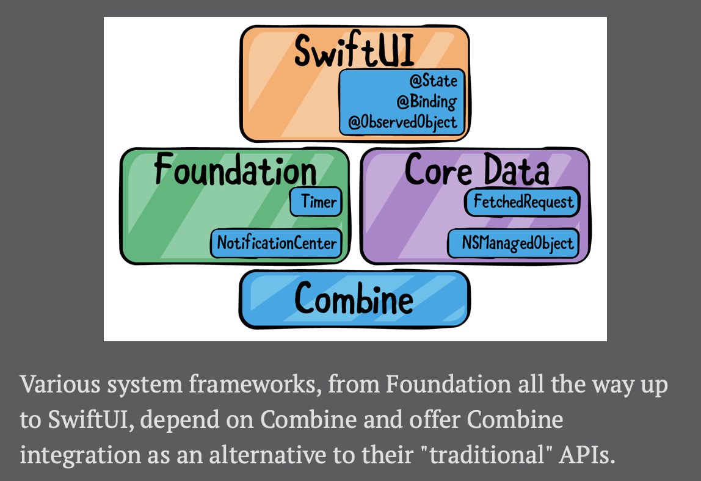
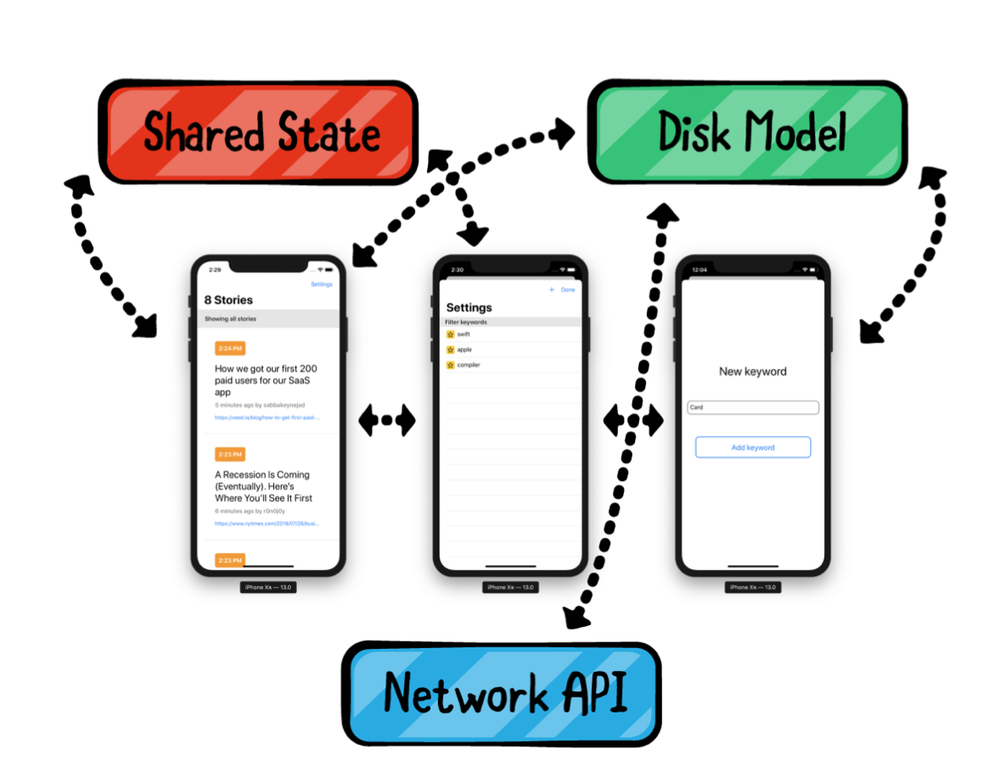
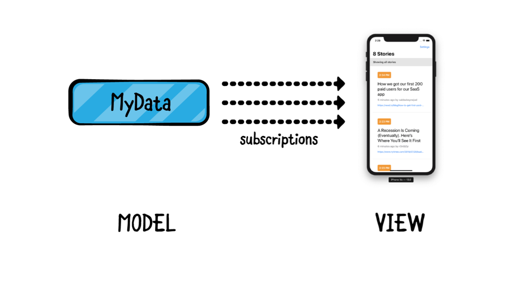
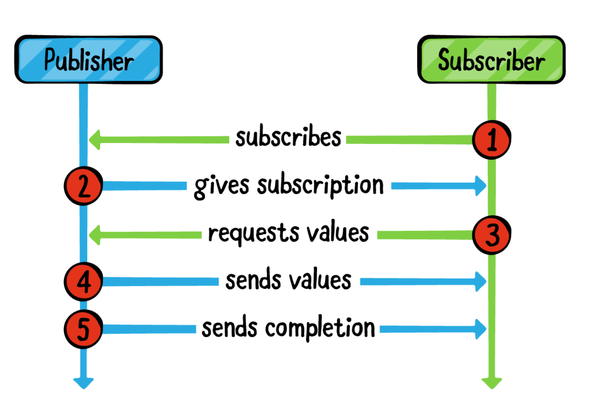
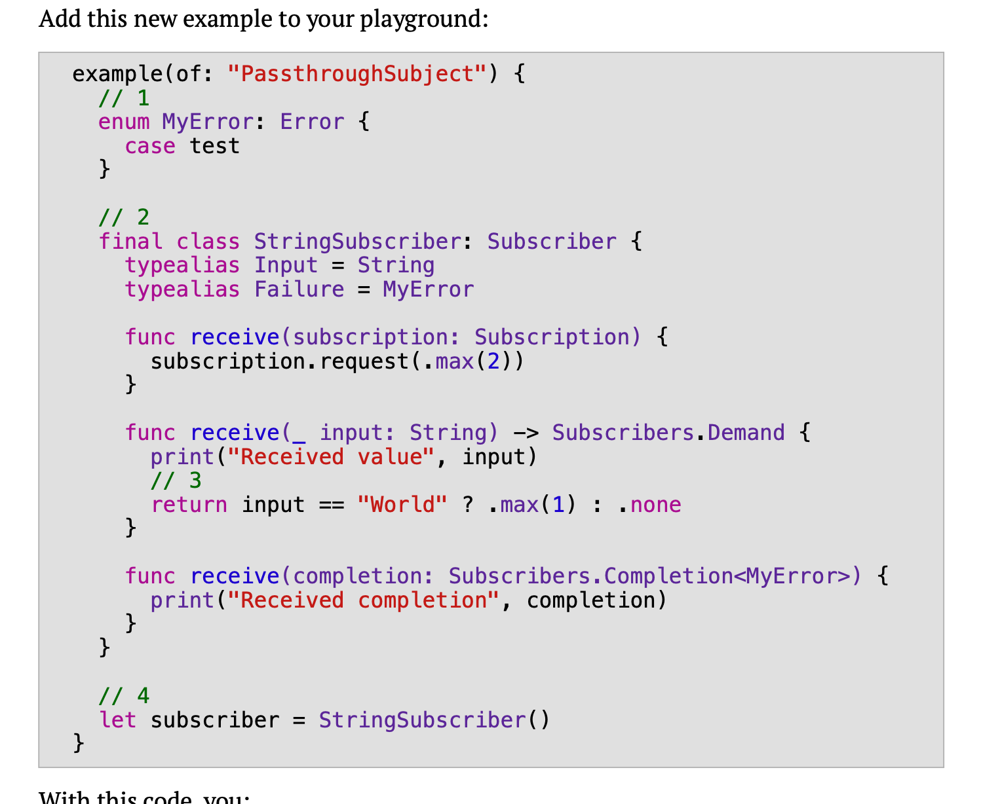
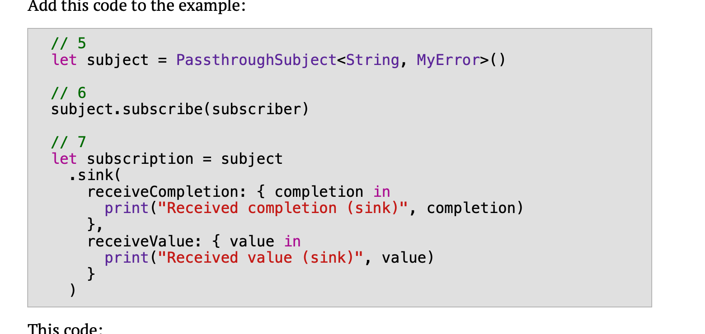
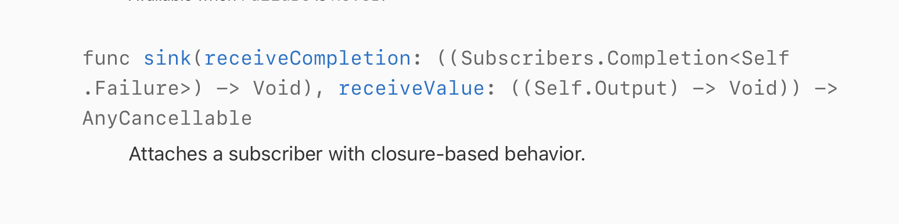

# Ch 1: 컴하!

"The Combine framework provides  a **declarative** approach for how your app processes events.

#### Asynchronous programming

애플은 이미 Combine API를 Foundation framework에서 통합시켰습니다. Timer, NotificationCenter나 Core Data같은 코어 프레임워크는 이미 Combine을 사용하고 있습니다.

#### Foundation of Combine

- 기존에 Foundation, UIKit, AppKit에서 사용하던 비동기 프로그래밍 방식 설명
  - NotificationCenter, The delegate pattern, Grand Central Dispatch(Operations), Closures
- Combine의 목적: 혼돈의 비동기 프로그래밍의 세계를 질서정연하게 하기 위한 Swift 생태계에 도입.
- Apple은 Combine API를 Foundation 프레임웤에 이미 통합시켰다. 그래서 Timer, NotificationCenter, Core Data는 이미 Combine을 사용하고 있음.
- Combine은 SwiftUI 프레임워크와도 쉽게 통합되도록 설계되었음.




- Foundation에서 SwiftUI에 이르기까지 다양한 시스템 프레임워크가 Combine을 의존하고 있고, 각 프레임워크의 전통적인 API들의 대안으로 Combine integration을 제공하고 있음.
- Combine은 Apple의 프레임워크라서 Timer라든지 NotificationCenter 같은 이미 잘 검증되고 만들어진 API들이 없어지는 것을 목표로 하지 않음. Combine은 이런 프레임워크들과 함께 앱에서 사용되는 모든 타입들에 대해서 Combine으로 통합되어 서로 새롭고 universal한 language를 통해 커뮤니케이션 하도록 도와주는 것을 목표로 함.

#### Foundation of Combine

- **Declarative, reactive**
- Rx랑 비슷하지만 다름. 하지만 Core한 컨셉은 동일한거 인정.
- iOS 13의 허들이 있음.
- 나중에 Combine이 뜰꺼니깐 이란 말을 하고 있음..(애플 홍보)

#### Combine basics

- Combine의 3가지 핵심요소: **publisher**, **operator**, **subscriber**

#### Publishers

- Publisher는 시간이 지남에 따라 하나 이상의(subscriber와 같은) 대상에세 value를 방출할 수 있음.

- Publisher는 아래의 3가지 타입의 이벤트를 방출할 수 있음.
  1. publisher의 제네릭 Output 타입의 value.
  2. A successful completion.
  3. A completion with an error of publisher's Failure Type (퍼블리셔의 Failure타입의 에러와 함께 completion)
  - Publihser는 0개 이상의 output value를 방출할 수 있음. success로 completion되거나 failure로 인해 completion 되면 더 이상 이벤트를 방출하지 않음.
  
- publisher의 좋은 기능 중 하나는 build-in error handling.
  
  - 이미 내장되어 있기 때문에 사용자가 나중에 옵션적으로 추가하는게 아님. (선택적이지 않음)
  
- Publisher Protocol은 2가지의 제네릭 타입을 갖는다.

  - **Publisher.Output** : publisher의 output value의 타입.
  - **Publisher.Failure** : publisher가 fail되었을 때 publisher가 던질 에러타입. 만약에 publisher가 절때 fail하지 않는다면, failure 타입을 Never 로 명시하면 됨.

- 위의 두가지 타입을 가지고 publisher를 구독할 때 어떤 타입의 output value와 어떤 error타입이 올지 예측 가능.

#### Operators

- Operators는 Publisher 프로토콜에 선언된 메서드들이고 publisher를 다시 return하거나 새로운 publisher를 리턴함.
- Operator들끼리 체이닝할 수 있어서 매우 유용함.
- Operator들은 highly decoupled하고 composable하기 때문에 한 구독의 실행에 대해 매우 복잡한 논리를 구현하기 위해 결합(combine)해서 사용할 수 있음.(네이밍이 왜 combine인줄 알랴줌..)
- 결정론적인 방법으로(In a clear deterministic way) 비동기적인 추상화된 작업들의 순서를 정의할 수 있음. > input/output 타입과 built-in error handling 때문에 가능. (input 타입과 output타입이 정해지기 때문)
- operator는 항상 input과 output을 가짐. 이를 upstream, downstream이라고 하는데, 상태 공유하는 것을 피할 수 있음. (side effect 방지)

#### Subscribers

- 모든 구독의 마지막은 항상 subscriber로 끝남. 일반적으로 Subscribers는 방출된 output이나 completion events를 가지고 무언가를 하는 역할임.
- Combine에는 2개의 빌트인 subscribers를 제공함. subscriber는 데이터 스트림을 가지고 하는 작업을 간단하게 해준다.
  - **sink**: output value와 completion을 받는 클로저를 제공함. (rx의 subscribe)
  - **assign**: 커스텀코드 없이 output의 결과를 데이터 모델이나 UI Control이 가진 특정 프로퍼티에 바인딩해서 kay path를 통해 화면에 직접 데이터를 보여줄 수 있게 해줌. (rx의 bind(to:)와 비슷)
- 데이터에 대해 다른 요구사항이 있는 경우 subscriber를 커스텀하는게 publisher를 생성하는것보다 쉽다. Combine uses a set of very simple protocols that allow you to be able to build your own custom tools whenever the workshop doesn't offer the right one for your task. 이런 말을 하는데 결국 Combine은 매우 간단한 프로토콜들을 여럿 사용하는데 이를 통해서 빌트인되어있지 않고 커스텀해야되는 경우 쉽게 해준다는 얘기같음.

#### **Subscription**

> 이 책에선 **subscription** 이라는 용어는 Combine의 Subscription 프로토콜과 이 프로토콜을 채택한 객체를 모두 지칭함. (+ complete chain of a publisher, operators, subscriber 얘네도)

- 구독하는 시점이 publisher의 스트림 체인을 활성화 시키는 시점임.
  - 굉장히 중요함 > publisher는 output을 받을 구독자가 없으면 값을 방출하지 않음.
- 구독은 사용자의 custom code와 에러 핸들링을 사용해 비동기 이벤트 체인을 한번만 선언한 후 이에 대해 다시 생각할 필요가 없게 해줌. (결국 한번 선언해놓고 알아서 도니 더 생각하지 않아도된단소리임.)
  - 비동기 이벤트 체인을 한번 선언해놓음. 선언형 **Declarative**
- 결국 전부 combine으로 짜게 되면 한번 구독을 해놓게 되면 시스템이 알아서 잘돌아간다.(without pull, push data를 한다거나 다른 객체의 콜백을 호출한다거나 하는 일 없이)



- **Cancellable** : Combine에서 제공하는 Cancellable 때문에 구독을 메모리로 관리할 필요가 없음.
- 두 subscribers(sink와 assign)가 모두 Cancellable을 채택하고 있다. > 구독코드는 **Cancellable** 객체를 리턴한다. 메모리로부터 객체를 해제할 때마다 전체 구독은 취소되고 메모리로부터 리소스가 해제된다.
- 즉, 뷰컨트롤러의 프로퍼티에 저장함으로써 구독의 수명을 쉽게 바인딩할 수 있음. 이렇게 하면 유저가 뷰스택에서 뷰컨을 dismiss할 때마다 뷰컨의 프로퍼티를 deinit할거고 구독 또한 취소될거임. > 즉 프로퍼티에 구독을 저장해뒀으니깐 그 뷰컨이 날라갈때 그 뷰컨의 프로퍼티도 할당해제될거고 그럼 그 구독이 날아가버려서 취소 된단 소리같음..)
  - 이걸 자동화하기 위해서 `[AnyCancellable]`collection 프로퍼티를 갖고 여기에다가 구독을 담으면된다. 
  - `Set<AnyCancellable>` 


#### 그래서 Combine code가 standard code에 비해서 장점은?

- Combine도 Core Data, URLSession, UIKit과 같이 추상화된 프레임워크다. (async code에 대해) 그러니 직접 이런 추상화를 작성하는 것보다 이런 추상화 프레임워크를 쓰는게 훨씬 더 효율적이고 안전하고 편리하다.
- 시스템 수준의 또 다른 추상화 수준은 테스트가 긴밀하게 통합되고 오래 지속되는 지원을 위한 안전한 기술임을 의미함.
- Combine 채택 시 장점
  - Combine은 시스템 수준에서의 integration 되어있음.(Combine is integrated on the system level.) 이 말은 Combine은 공개적으로 사용할 수 없는 언어의 기능을 사용한다는 것. (사용자가 직접 만들 수 없는 API를 제공해준다.)
  - delegate, IBAction, closure등과 같은 고전적인 방법의 비동기 스타일은 버튼이나 제스쳐 등과 같은 이벤트에 대한 처리 케이스에 대해 커스텀 코드를 직접 작성하도록 하게한다.  테스트 코드를 위해 작성해야할 커스텀 코드들이 많아질거임. 하지만 Combine은 이미 잘 테스트 된 Operator를 제공한다.
    - 결국 내가 직접 커스텀 코드 작성하는걸 테스트해야되는데 이미 이런 커스텀코드를 대체할 well tested operators들이 있다는 소리.
  - 모든 비동기 작업들이 동일한 인터페이스를 사용한다 (Publisher - composition and reusability become extremely powerful.)
  - Combine's operators are highly composable.(plug-and-play)
  - 비동기 코드의 테스트코드를 작성하는 것은 매우 복잡한데 Combine은 이미 비동기 연산자(asynchrnous operators)가 테스트되어져 있고 비즈니스 로직만 테스트하면 된다. 즉, input과 구독의 output(기대하는)만 테스트하면 됨.


#### App architecture

- Combine은 앱 구조에 영향을 주는 프레임웤이 아님. MVC, MVVM, VIPER 등에 쓸 수 있음.
- Combine을 점진적이거나 선택적으로 이미 짜여진 코드에 적용할 수 있음. "all or nothing"이 아님 이건 사용자가 선택하기 나름임.
- as-is를 유지하면서 적용하기엔 data model을 converting하거나, 네트워킹 레이어를 조정하거나(adapting) 새로운 코드를 작성할 때 Combine을 간단하게 도입함으로써 Combine을 적용해 볼 수 있을거다.
- SwiftUI랑 Combine을 같이 채택 하면 약간 다른데, 이 경우 MVC에서 C를 빼야 말이됨. 
- C를 빼야 말이 되는건 스유랑 같이 사용해서 그런거임. 얘네는 둘이 케미가 잘맞음.But that's thanks to using Combine and SwiftUI in tandem — those two are simply on fire when in the same room.



#### Key points

- **Combine** is a **declarative, reactive** framework for processing **asynchronous** events over time.

- **Publisher**, **Operators**, **Subscribers**


# Ch 2. Publisher & Subscribers

#### Hello Publisher

- Publisher 프로토콜은 Combine의 핵심. Publisher는 events를 publishe or emit 함.
- NotificationCenter는 이제 `publisher(for:object:)` 메서드를 갖는다. 이 메서드는 broadcated notifications을 publish 할 수 있는 Publisher 타입을 제공한다.
- NotificationCenter.default가 publisher를 생성하는 예제코드.
- 애플문서 정의 들어가보면 얘가 Output타입은 Notification이고 Failure는 Never다 그럼 앤 Publisher<Notification, Never> 인걸 유추할 수 있음.
- 전통적인 방법으로 NotificationCenter의 addObserver, post, removeObserver예제.

#### Hello Subscriber

- NotificationCenter로 publish해서 sink로 구독하는 예제.
- Just를 sink(receiveCompletion, receiveValue)하는 예제.

#### Subscribing with assing(to:on:)

- [String]으로 부터 publihser를 만들어서 assign하는 예제.

#### Hello Cancellable

- Subscription은 cancellation token으로써 AnyCancellable의 인스턴스를 반환함.(subscription을 취소할 수 있도록 해준다.) Anycancellable().cancel()

- 명시적으로 cancel()해주지 않으면 publisher가 complete될 때까지 또는 일반적인 메모리 관리로(normal memory management) 인해 저장된 구독이 deinit 될 때 까지 계속 됨.

#### Understanding what's going on




```swift
public protocol Publisher {

  associatedtype Output

  associatedtype Failure : Error
}

func receive<S>(subscriber: S) where S: Subscriber,
  Self.Failure == S.Failure,
  Self.Output == S.Input
}

extension Publisher {
  public func subscribe<S>(_ subscriber: S) where S : Subscriber,
  Self.Failure == S.Failure,
  Self.Output == S.Input
}
```

```swift
public protocol Subscriber: CustomCombineIdentifierConvertible {
  associatedtype Input
  associatedtype Failure: Error
  func receive(subscription: Subscription)
	func receive(_ input: Self.Input) -> Subscribers.Demand
	func receive(completion: Subscribers.Completion<Self.Failure>)
}
```

- The connection between the publisher and the subscriber is the **subscription**.

```swift
public protocol Subscription: Cancellable,
CustomCombineIdentifierConvertible {
	func request(_ demand: Subscribers.Demand)
}
```

- subscriber가 `request(_:)` 를 호출해서 최대 또는 무제한의 값을 받을 수 있음을 의미함.

> subscriber가 얼마나 많은 값을 받을지 조정(stating)하는 개념은 **backpressure management**라고 알려져있다. publisher가 subscriber가 처리할 수 있는것보다 많은 값을 받게 되면 flow 문제가 생길 수 있다. Backpressure는 18장에서 다룰 예정.

- Subscriber안에서 request메서드가 Demand 타입을 반환한다. subscriber의 receive메서드에서 subscription.request를 최초로 호출할 때 subscriber가 받을 수 있는 max값을 한 번 정했더라도 ,새 값을 받을 때 마다 이 최대 값을 조절할 수 있다.
- `Subscribers.Demand` : 요청받은 아이템의 갯수, subscription을 통해 subscriber로부터 publisher에게 전달된다.

> max값을 subscriber.receive()에서 조절하는 것은 추가적인 사항임. 새 max 값이 현재 max 값에 추가됩니다. max값은 반드시 양수여야하며 음수를 전달하면 `fatalError`가 발생함. 새 값을 받을 때마다 기존의 max 값을 늘릴 수 있지만 줄일 수는 없습니다.


(다시 정리 : Subscriber.receive(_:)는 Demand를 리턴합니다 . 처음에 subscription.request 호출에서 갯수를 subscriber가 받을텐데 receive에서 추가적으로 덮어쓸 수 있습니다.  receive메서드에서 현재 max에 더해집니다. max value는 양수여야하고, 음수를 전달하면 fatalErrorr가 발생합니다.

#### Creating a custom subscriber

- 커스텀 subscriber 예제.

#### Hello Future

- Future는 asynchronously produce a single result and then complete. (Just와 차이점은 생성을 비동기적으로 한다는 것)
- Future는 구독이 두번일어났다고 해서 promise를 재실행하지 않는다. 대신 output을 share하거나 replay한다.
- 구독이 없어도 "Original"이 찍힐꺼다. future의 생성은 future를 생성하자마자 실행된다. subscriber를 요구하지 않는다. (publisher랑 좀 다름)

#### Hello Subject

- subjects는 non-Combine imperative code(Combine을 사용하지 않은 명령형 코드)를 Combine의 subscriber에게 값을 보낼 수 있도록 중개자 역할을 합니다. 
- CurrentValueSubject 
  - 현재 값을 볼 수 있음. (RxSwift의 BehaviorSubject 같은 녀석)
  - subject.value = 값 을 할 수 있음. 하지만 finish는 무조건 send로.

#### Dynamically adjusting demand

```swift
example(of: "Dynamically adjusting Demand") {
   final class IntSubscriber: Subscriber {
       typealias Input = Int
       typealias Failure = Never
       
       func receive(subscription: Subscription) {
           subscription.request(.max(2))
       }
    
       func receive(_ input: Int) -> Subscribers.Demand {
           print("Received value", input)
           
           switch input {
           case 1:
               return .max(2)
           case 3:
               return .max(1)
           default:
               return .none
           }
       }
    
       func receive(completion: Subscribers.Completion<Never>) {
           print("Received completion", completion)
       }
   }
   
   let subscriber = IntSubscriber()
   
   let subject = PassthroughSubject<Int, Never>()
   
   subject.subscribe(subscriber)
   
     subject.send(1) // 4
     subject.send(2) // 4
     subject.send(3) // 5
     subject.send(4) // 5
     subject.send(5) // 5
     subject.send(6) // 5
}
```


#### Type erasure

- subscriber가 publisher에 추가적인 detail한 정보없이 이벤트를 받도록 하려는 경우가 있다.
- `eraseToAnyPublisher()`
- AnyPublisher은 타입이 삭제된 Publisher Protocol을 준수하는 struct. 타입을 지우면 subscriber한테 publihser에 대한 디테일한 정보를 숨길 수 있다.
- AnyCancellable 또한 Cancellable을 채택한 type-erased class 임
- privatepublic과 private 프로퍼티를 한 쌍으로 사용하고 하는 경우, 이 프로퍼티의 owner가 private publisher에 value를 보내고 외부에 있는 caller에겐 public publisher만 접근 가능하게 해서 구독만 가능하게 하고 값은 보내고 싶지 않을 때 유용함.  -> 이거 솔직히 뭔말인지모르겠음
- AnyPublisher는 send(_:) 오퍼레이터가 없음. 새로운 value를 추가할 수도 없음.
- 다시 보니깐 약간 subject에다가 asObservable하는 느낌임.


Object1 event

---

Obejct2   Subject

-------

publisher == asObservable() == private(set) var 와우: String

Object3 subsrcibe


---

## Discussion

- Publisher가 빌트인 되어 있는 에러 핸들링이 기능이 굉장히 좋은거라고 했는데, 선택적이지 않으면 좋은점은 무엇일까?
  - (One of the best features of publishers is that they come with error handling built in; error handling isn't something you add optionally at the end, if you feel like it.)
- 자꾸 Combine은 모든게 잘 테스트 됐다고 하는데..그걸 우리가 확인할 방법이 있을까요? Combine이 어떤 테스트들을 했는지 볼 수 있는 방법은?


출처 : https://store.raywenderlich.com/products/combine-asynchronous-programming-with-swift


let ob = Observable<String>.

create { observer in

observer.onNext("hello world")

}


<Rx>

Observable: 이벤트를 흘려주고 구독가능한 스트림

observer: Observable에 이벤트를 흘려주는애

subscriber: Observable 구독하는 

subject: Observable + observer


subject.(asObservable)

subscribe


subject.asObservable()

.subscribe { event in

})


subject.onNext(event)


class ViewModel, ViewController {






}


nonCombineSubject

nonCombineSubject.onNext("보내")

nonCombine.onNext("두번 보내")





input > subscribe > event handling

Observable > 

Publisher > 


INPUT      :   Processsing

Inpjut >>> | input.subscribe.처리 |


Observable.just(data) > subscribe


Just(


Observable.send(event)

Publisher.send(event)


let pb = publisher.create { e in

e.send("sdfsdf"

})


pb.subscribe(subscriber)