# Ch 3: Transforming Operators

### Operators are publisher

- 오퍼레이터는 publisher의 종류다. 실제로 operator들은 publisher를 반환한다.
- Operator의 목적이 에러처리가 아니라면 일반적으로 upstream publisher에서 error를 수신했을 때 downstream으로 그대로 전달된다.

> 이번 챕터에서는 transforming  operator를 중점으로 다룰 것이고 error handling operator는 다루지 않을것이다. 에러 처리는 챕터 16에서 배우게 될것.


### Collecting values

Publisher는 단일 값 또는 collection 형태의 값을 emit 할 수 있다. 뷰들의 리스트를 다루는 등 대부분 단일 값보단 collection을 다루게 될것이다. 


#### collect()

- individual values > array of those values.
- upstream에서의 complete가 중요.

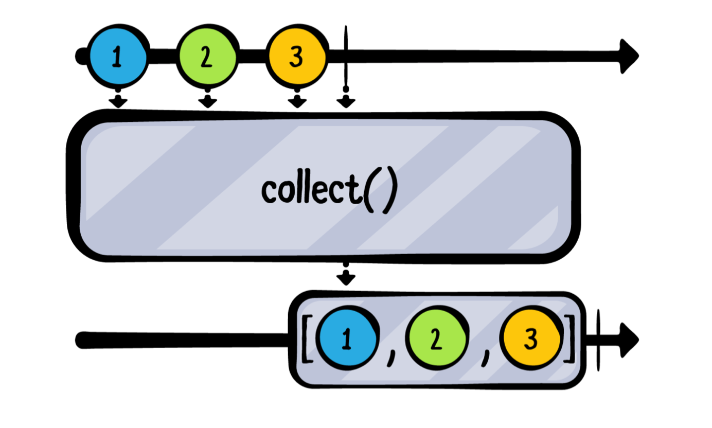

> Note: `collect()`나 다른 버퍼링을 하는 오퍼레이터를 사용할 땐 조심해야한다. 받은 값들을 저장하기 위해서 메모리를 무제한으로 사용하기 때문에.

```swift
// Publisher: ["A", "B", "C", "D", "E"].publisher

아무것도 안했을 경우
"A", "B"... 한줄씩 나옴.

.collect()
// ["A", "B", "C", "D", "E"]

.collect(2)
// 이렇게 갯수를 적어주면 아래와 같이 출력된다.
["A", "B"]
["C", "D"]
["E"]

마지막에 "E"만 나왔는데 collect가 명시된 buffer크기(2)를 다 채우기전에 upstream에서 complete됐기 때문에
남은 값이 array로 방출됨.

```


### Mapping values

#### map(_:)

- 너무 쉬우니 넘어감.

#### Map key paths

- map 계열의 오퍼레이터에는 key pat를 사용해서 1~3개의 프로퍼티에 맵핑할 수 있는게 있다.
  - `map<T>(_:)`
  - `map<T0, T1>(_:_:)`
  - `map<T0, T1, T2>(_:_:_:)`

  ```swift
  example(of: "map key paths") {
      let publisher = PassthroughSubject<Coordinate, Never>()

      publisher
          .map(\.x, \.y)
          .sink(receiveValue: { x, y in
              print("The coordinate at (\(x), \(y)) is in quadrant", quadrantOf(x: x, y: y))
          })
          .store(in: &subscriptions)

      publisher.send(Coordinate(x: 10, y: -8))
      publisher.send(Coordinate(x: 0, y: 5))
  }

  /*
  ——— Example of: map key paths ———
  The coordinate at (10, -8) is in quadrant 4
  The coordinate at (0, 5) is in quadrant boundary
  */
  ```

#### tryMap(_:)

- map을 포함해서 `try`오퍼레이터를 가지고 있는 오퍼레이터들이 있다. `try`는 error를 throw할 수 있는 클로져를 받는다. 만약에 error를 throw한 경우 downstream에 error가 방출될것이다.

  ```swift
  example(of: "tryMap") {
      Just("Directory name that does not exist")
          .tryMap { try FileManager.default.contentsOfDirectory(atPath: $0) }
          .sink(receiveCompletion: { print($0) },
                receiveValue: { print($0)} )
          .store(in: &subscriptions)
  }
  
  // tryMap output => failure completion event with error message.
  
  /*
  failure(Error Domain=NSCocoaErrorDomain Code=260 
  "The folder “Directory name that does not exist” doesn’t exist."
  UserInfo={NSUserStringVariant=(
      Folder
  ), 
  NSFilePath=Directory name that does not exist,
  NSUnderlyingError=0x600002fa7000 {Error Domain=NSPOSIXErrorDomain Code=2
  "No such file or directory"}})
  */
  ```

  

### Flattening publishers

#### flatMap(maxPublishers:_:)

- flatMap operator는 여러개의 upstream publisher를 single downstream publisher로 flatten해준다.

- flatMap에서 나온 publisher는 upstream publisher와는 다른 타입을 가진다.

- Combine에서 flatMap가 사용되는 일반적인 케이스는 publisher가 방출하는 value로 publisher를 방출할 때 이를 구독하고 싶을 때입니다. (Publisher가 Publisher를 방출하고 이를 구독할 때)

- 예제를 통해 알아보자

  ```swift
  example(of: "flatMap") {
      struct Chatter {
          let name: String
          let message: CurrentValueSubject<String, Never>
          
          init(name: String, message: String) {
              self.name = name
              self.message = CurrentValueSubject(message)
          }
      }
          
      let charlotte = Chatter(name: "Charlotte", message: "Hi, I'm Charlotte!")
      let james = Chatter(name: "James", message: "Hi, I'm James!")
      let chat = CurrentValueSubject<Chatter, Never>(charlotte)
      
      chat
          .sink(receiveValue: { print($0.message.value) })
          .store(in: &subscriptions)
      
      charlotte.message.value = "Charlotte: How's  it going?"
      chat.value = james
  }
  
  // output
  /*
  ——— Example of: flatMap ———
  Hi, I'm Charlotte!
  Hi, I'm James!
  */
  ```

  - 여기서 문제는 charlotte에게 How's it going을 보냈지만 chat에선 받지 못했다는거다. 이렇게 나온 이유는 Chatter publisher인 `chat`을 구독하고 있기 때문이다. 방출된 `Chatter` 의 프로퍼티인 `message` publisher를 구독하고 있지 않기 때문이다. (Chatter의 프로퍼티인 message가 아니라 Chatter자체를 구독하고 있기 때문에)

  - 아래와 같이 코드를 바꿔보자.

    ```swift
    chat
      .flatMap { $0.message }
      .sink(receiveValue: { print($0) })
      .store(in: &subscriptions)
    // output
    /*
    ——— Example of: flatMap ———
    Hi, I'm Charlotte!
    Charlotte: How's  it going?
    Hi, I'm James!
    */
    
    charlotte.message.value = "Charlotte: How's  it going?"
    chat.value = james
    james.message.value = "James: Doing great, You?"
    charlotte.message.value = "Charlotte: I'm doing fine thanks."
    
    // output
    /*
    ——— Example of: flatMap ———
    Hi, I'm Charlotte!
    Charlotte: How's  it going?
    Hi, I'm James!
    James: Doing great, You?
    Charlotte: I'm doing fine thanks.
    */
    ```

- flatMap은 수신한 모든 publisher의 output들을 single publisher로 만든다. 근데 이렇게 되면 메모리 문제가 될 수 있다. 왜냐하면 single publisher를 업데이트하기 위해서 flatMap으로 보낸 publisher 수 만큼 버퍼로 갖고 있어야 되기 때문에.

- flatMap의 메모리 공간 사용(memory footprint) 관리를 위해 옵션으로 얼마나 많은 publisher를 flatMap이 받을 건지 명시 할 수 있다. `maxPublishers`파라미터

  - `flatMap(maxPublishers: .max(2)) { $0.message }`

  - 아래 다이어그램 상으로 보면 P3이 방출은 되지만 무시된다.

    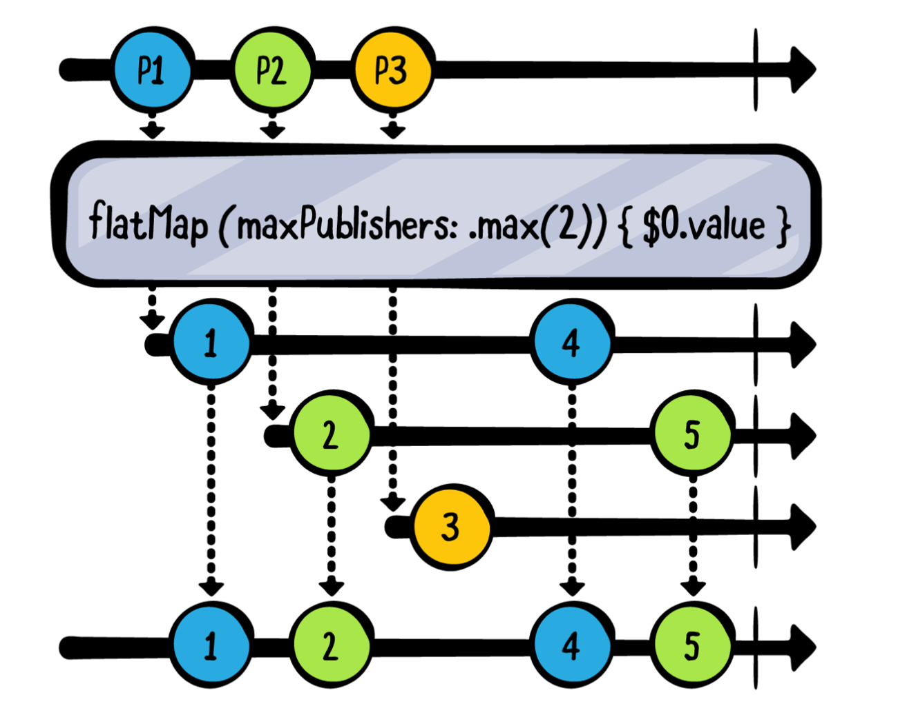

### Replacing upstream output

#### replaceNil(with:)

```swift
example(of: "replaceNil") {
    ["A", nil, "C"].publisher
        .replaceNil(with: "-")
        .sink(receiveValue: { print($0) })
        .store(in: &subscriptions)
}

/*
——— Example of: replaceNil ——— Optional("A")
Optional("-")
Optional("C"
*/
```

- `??`를 사용하는 것과 `replaceNil`을 사용하는 것에는 미묘한 차이가 있는데, `??`오퍼레이터는 다른 옵셔널을 반환할 수 있는 반면, replaceNil은 그럴 수 없다. 

#### replaceEmpty(with:)

- publisher가 value를 방출하지 않고 complete 되었을 때.

- 테스트 시 조작 특정작업의 완료만 관심이 있을 경우.

  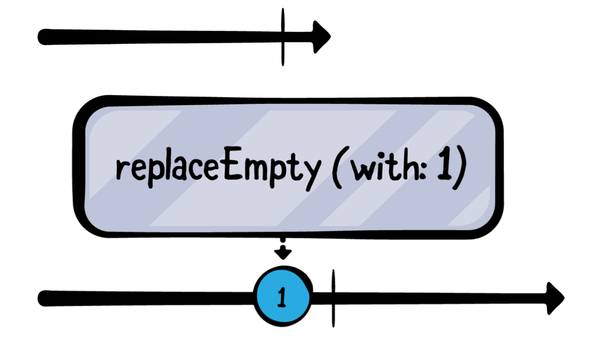

  ```swift
  example(of: "replaceEmpty(with:)") {
    // 1
    let empty = Empty<Int, Never>()
  // 2
  empty
    .replaceEmpty(with: 1)
  	.sink(receiveCompletion: { print($0) }, 
        receiveValue: { print($0) })
    .store(in: &subscriptions)
  }
  ```


### Incrementally transforming output

#### scan(_:_:)

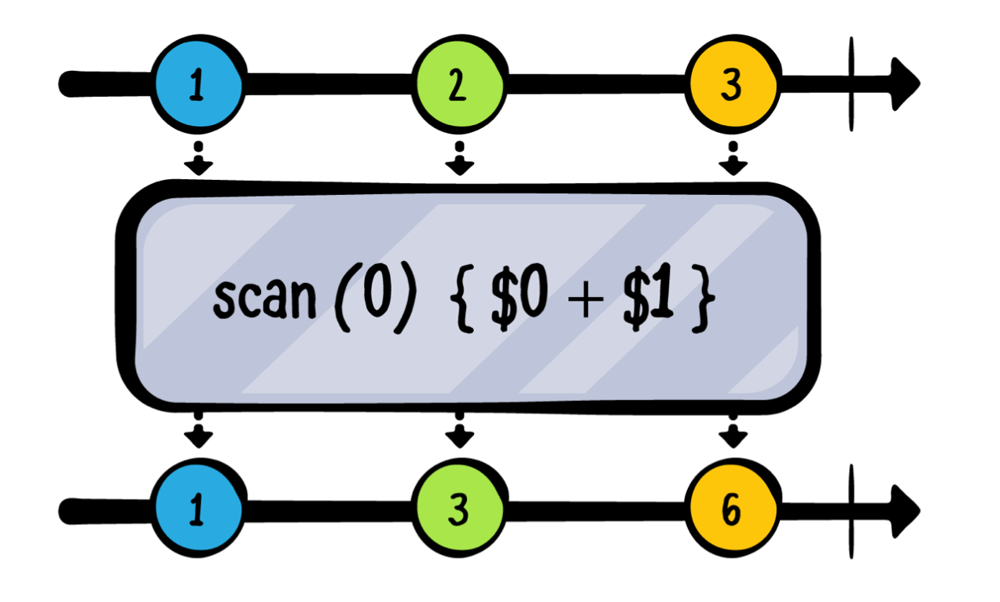

- scan은 마지막으로 클로저에서 반환했던 value와 함께 현재 upstream에서 closure에 방출한 값을 동시에 현재 클로저에 제공합니다. (현재 클로져에 제공하는 값이 두갠데 하나는 upstream에서 내려온 값, 하나는 이전에 클로져에서 반환했던 값이라는 소리)
  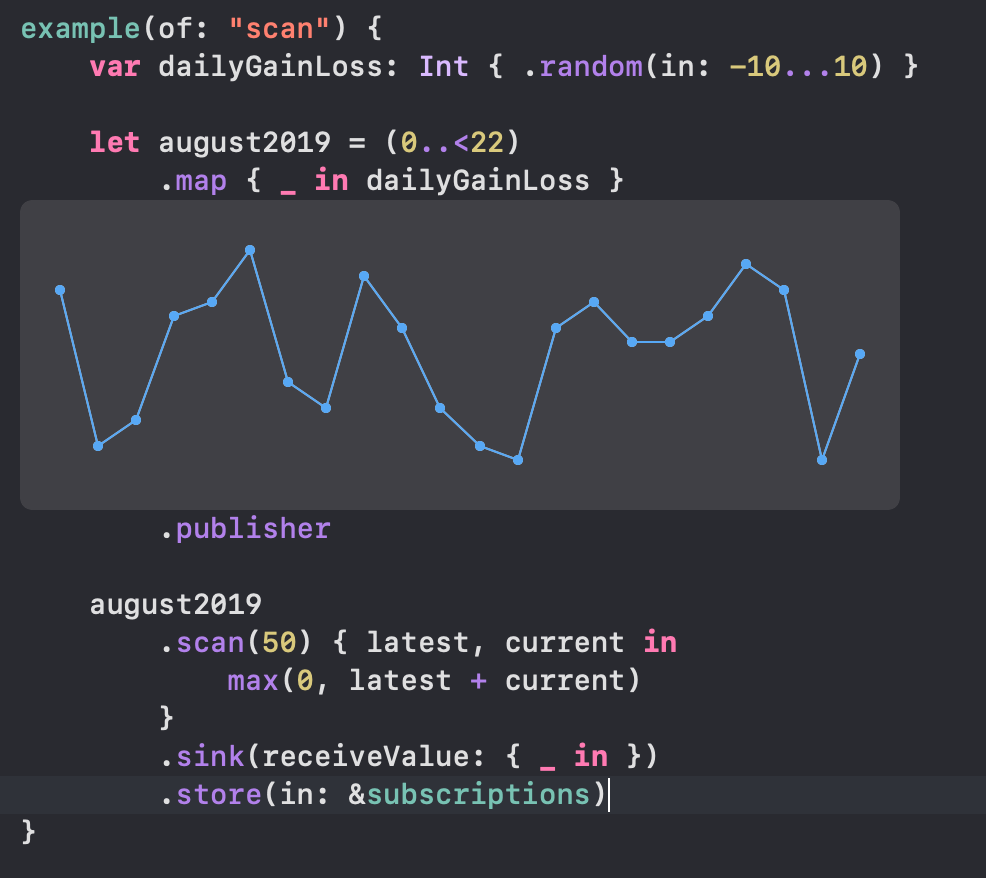


- `tryScan` 이라는 에러륻 던질 수 있는 녀석도 있음. 만약에 클로져안에서 error를 던질 겨우 `tryScan`은 fails with that error.


# Ch 4: Filtering Operators

### Filtering basics

#### filter

- 쉬우니 넘어감

#### removeDuplicates()

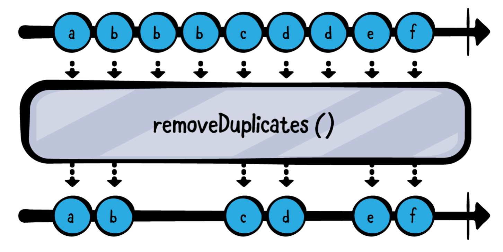

> value가 Equatable을 채택하지 않는다면? `removeDuplicates`는 또 옵션으로 `.removeDuplicates(by..)` 를 제공한다. 이 클로져는 2개의 value를 받고 두개가 같은지 다른지를 Bool값으로 반환해준다.

### Compacting and ignoring

#### compactMap

​	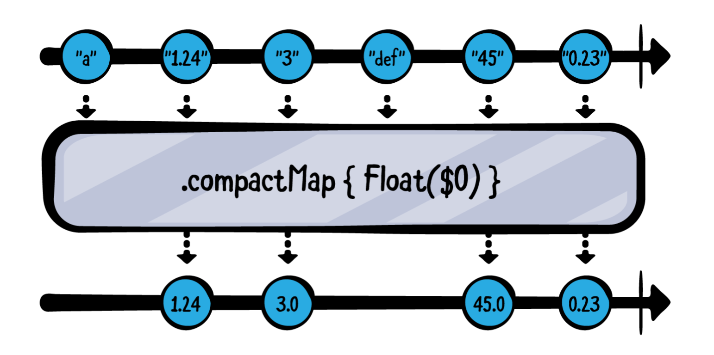

#### ignoreOutput

- publisher가 어떤 값을 방출했는지는 관심없고, complete의 여부만 중요한 경우 ignoreOutput 오퍼레이터를 사용하면됩니다.

  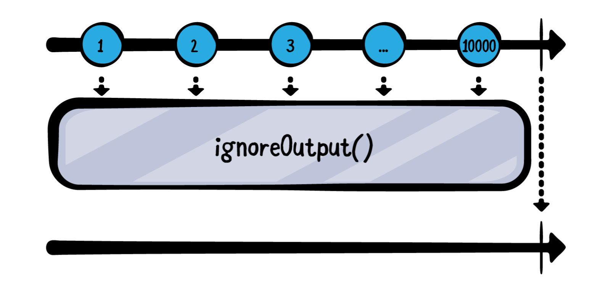


### Finding values

#### first(where:)

- 중요한 점: 이 operator는`lazy` 임. <= 이것의 의미는?

  - 매칭되는 조건을 찾을때까지만 value를 취합니다. 조건을 만족하는 값을 찾는 순간 더 이상 value를 취하지 않고 subscription을 cancel하고 complete 시킨다.

  ```swift
  example(of: "firstWhere") {
      let numbers = (1...9).publisher
      
      numbers
      .first(where: { $0 % 2 == 0 })
          .sink(receiveCompletion: { print("Completed with : \($0)") },
                receiveValue: { print($0) })
          .store(in: &subscriptions)
  }
  
  /*
  ——— Example of: firstWhere ———
  2
  Completed with : finished
  */
  ```

#### last(where:)

- first와 반대되는 오퍼레이터. 당연한 소리지만 이 오퍼레이터를 적용하기 위해선 publisher가 반드시 complete나야 한다. (어떤게 마지막인지 알기 위해서)


### Dropping values

#### dropFirst
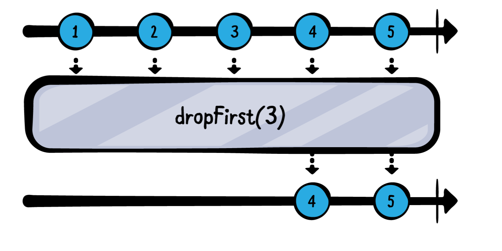

```swift
example(of: "dropFirst") {
  let numbers = (1...10).publisher
  numbers
    .dropFirst(8)
    .sink(receiveValue: { print($0) }) .store(in: &subscriptions)
}

/*
——— Example of: dropFirst ———
9
10
*/
```

#### dropWhile

- 조건이 만족할 때까지 무시
- ex) `.drop(while: { $0 % 5 ! 0 })`

- filter와의 중요한 차이점: filter는 upstream publisher로 부터 모든 값에 대해서 멈추지 않는거고(모든 값들에 대해 계속 조건을 검사함), drop(while)은 조건이 만조간 뒤로는 조건검사를 하지 않는다.

  ```swift
  .drop(while: { print("x")
    return $0 % 5 != 0
  })
  
  // 요렇게 확인해보면 조건 만족후엔 print가 안찍히는걸 확인할 수 있다.
  ```

#### drop(untilOutputFrom:)

- ready에서 값을 방출할 때부터 스트림의 이벤트를 받는다.

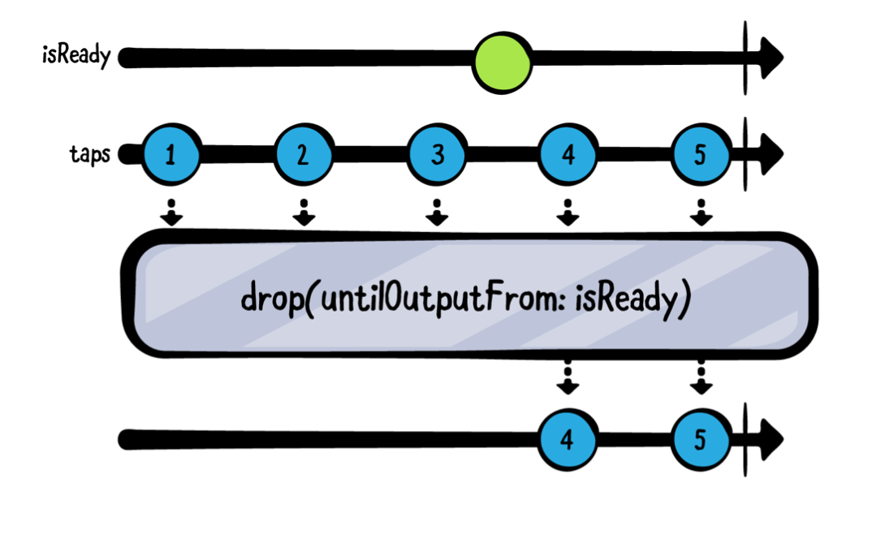

#### prefix

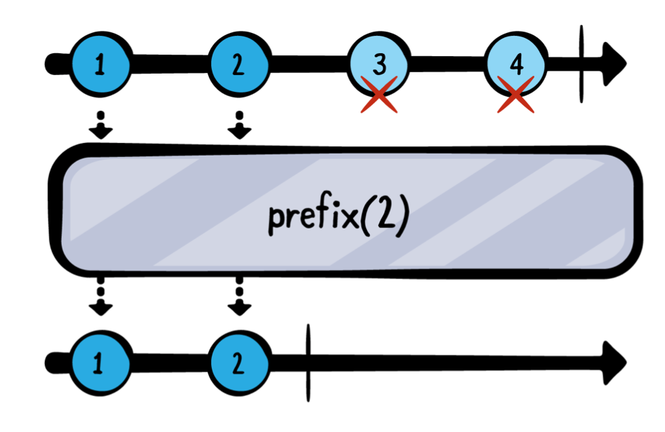


