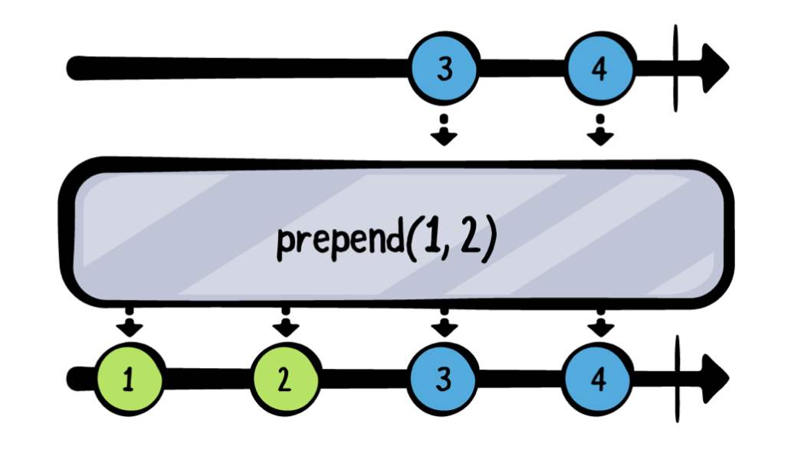
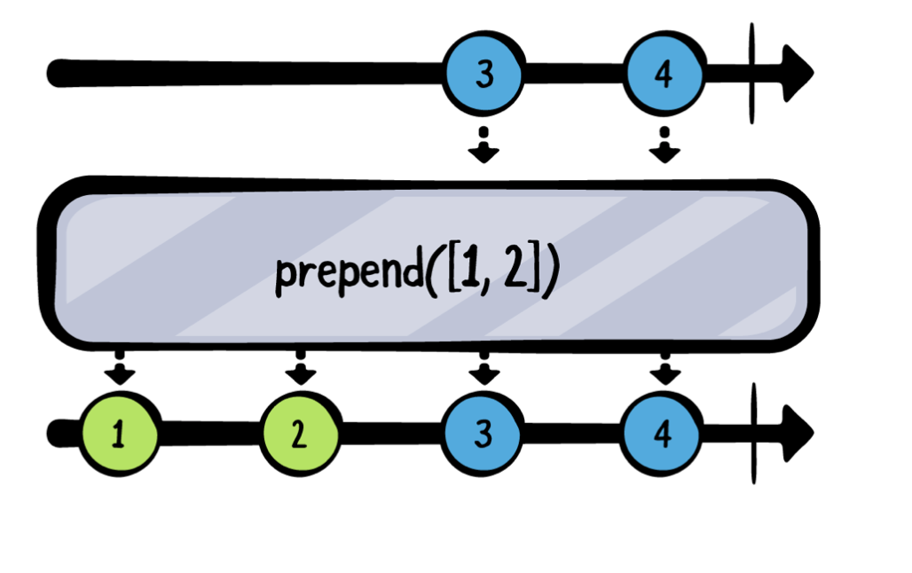
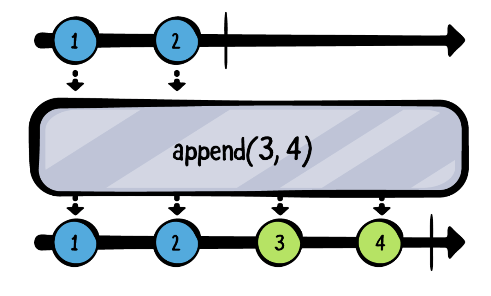
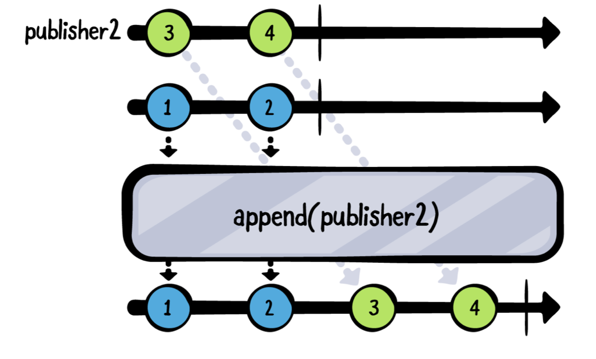
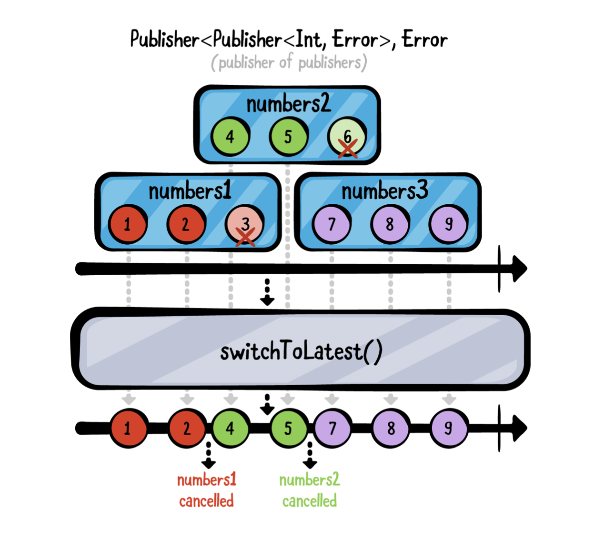
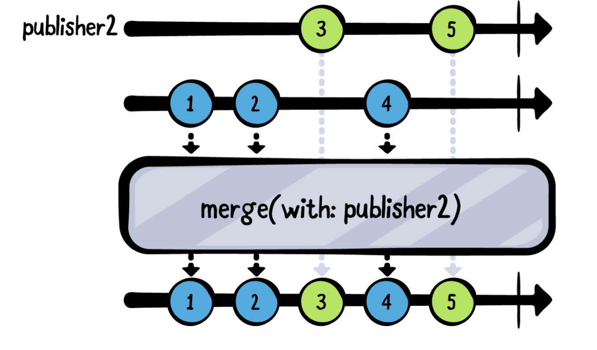
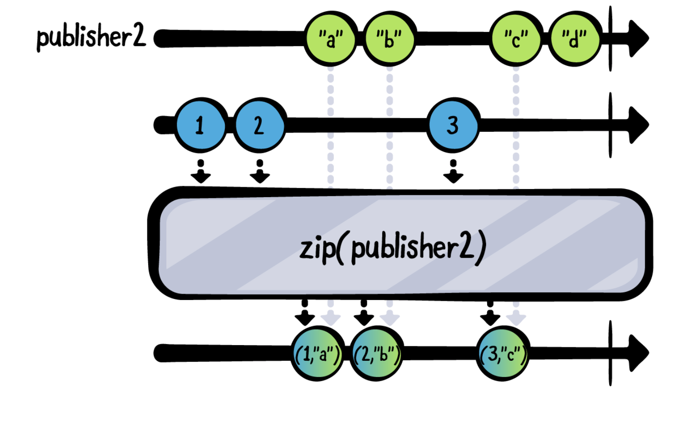

# Ch 5: Combining Operators


### Prepending

#### prepend(Output...)

- 가변 매개변수를 original publisher앞에 추가할 수 있다.

- prepend를 여러개 붙일 경우 가장 마지막에 붙인 prepend가 맨 앞에 붙는다.

  ```swift
  publisher
    .prepend(1, 2)
    .prepend(-1, 0)
  // 이 경우 -1, 0, 1, 2 순으로 붙는다.
  ```

  



#### prepend(Sequence)

- prepend와 같지만 input으로 `Sequence` 프로토콜을 따른 타입이 오게된다.(ex: Array, Set)

  

	```swift
	//요런것도 가능
	
	let publisher = [5, 6, 7].publisher
	    
	    publisher
	        .prepend([3, 4])
	        .prepend(Set(1...2))
	        .prepend(stride(from: 6, to: 11, by: 2)) // Strideable
	        .sink(receiveValue: { print($0) })
	        .store(in: &subscriptions)
	```


#### prepend(Publisher)

- original publisher에 값 뿐만 아니라 Publisher를 prepend 할 수 있다.
  ```swift
  let publisher1 = [3, 4].publisher
  let publisher2 = [1, 2].publisher
  
  publisher1
    .prepend(publisher2)
    .sink(receiveValue: { print($0) })
    .store(in: &subscriptions)
  // Output: 1,2,3,4
  ```
	
- 아래와 같은 경우를 생각해보자. PassthroughSubject를 통해 sink이후에 값을 보내보면 Publisher1이 아닌 Publisher2만 나오는걸 알 수 있다.

  - 생각을 해보자. 어떻게 Combine이 prepend된 publisher2가 value 방출을 끝냈는지 알 수 있을까? completion event를 방출했기 때문에 모른다... 이러 이유에서 prepend되는 publishers는 반드시 completion이 나야한다. 그래야 그 위에 publisher를 continue할 수 있다.

  ```swift
  let publisher1 = [3, 4].publisher
  let publisher2 = PassthroughSubject<Int, Never>()
  
  publisher1
    .prepend(publisher2)
    .sink(receiveValue: { print($0) })
    .store(in: &subscriptions)
  
  publisher2.send(1)
  publisher2.send(2)
  
  // Output: 1, 2
  ```

  - 만약 `publisher2.send(completion: .finished)` 를 추가하면 Output으로 publisher1도 출력되는걸 볼 수 있다.


### Appending

#### append(Output...)

- original publisher가 `.finished` event로 complete되면 그 이후에 뒤에 append함.
- 주의할 점: prepend랑 다르게 `append` 에 들어간 value는 뒤에 붙는다.(prepend는 뒤에 쓸수록 앞에 붙음)



#### append(Sequence)

- prepend(Sequence)의 반대 버전.


#### append(Publisher)




### Advanced combining

다음 섹션에선 서로 다른 publisher를 조합하는 것과 관련되서 조금 더 복잡한 오퍼레이터들에 대해서 배워봅니다. 

#### switchToLatest

- 보류중인 publisher의 구독을 취소하면서 전체 publisher 구독을 즉시 전환할 수 있으므로 최신 구독으로 전환 할 수 있습니다. (무슨소리지...)



```swift
example(of: "switchToLatest") {
    let publisher1 = PassthroughSubject<Int, Never>()
    let publisher2 = PassthroughSubject<Int, Never>()
    let publisher3 = PassthroughSubject<Int, Never>()
    
    // Create a second PassthroughSubject that accepts other PassthroughSubjects.
    let publishers = PassthroughSubject<PassthroughSubject<Int,Never>, Never>()
    
    // switch to the new one and cancel the previous subscription.
    publishers
        .switchToLatest()
        .sink(receiveCompletion: { _ in print("Completed!") },
              receiveValue: { print($0) })
        .store(in: &subscriptions)
    
    publishers.send(publisher1)
    publisher1.send(1)
    publisher1.send(2)
    
    // send publisher2 > cancel the subscription to publisher1
    publishers.send(publisher2)
    publisher1.send(3) // publisher2로 스위칭 되서 찍히지 않는다.
    publisher2.send(4)
    publisher2.send(5)
    
    publishers.send(publisher3)
    publisher2.send(6) //  publisher3로 스위칭 되서 찍히지 않는다.
    publisher3.send(7)
    publisher3.send(8)
    publisher3.send(9)
    
    // 다시 publisher1을 보내면 publisher1에 대해서 구독가능하다.
//    publishers.send(publisher1)
//    publisher1.send(100)
    
    publisher3.send(completion: .finished)
    publishers.send(completion: .finished) // completion.
}

```

- 언제 유용할까?
  - ex) 유저가 버튼을 눌러서 network request를 보내는 상황에서 유저가 다시 버튼을 다시 누르게 되면 두번째(second) network request를 트리거한다. 이 경우 첫번째 request를 없애고 가장 마지막 request에만 관심이 있는 경우 `switchToLatest`를 사용하면 좋다.
  - 아래 예제로 알아보자.

```swift
example(of: "switchToLatest - Network Request") {
    let url = URL(string: "https://source.unsplash.com/random")!
    
    // performs a network request to fetch a random image from Unsplash's public API
    func getImage() -> AnyPublisher<UIImage?, Never> {
        return URLSession.shared
            .dataTaskPublisher(for: url)
            .map { data, _ in UIImage(data: data) }
            .print("image")
            .replaceError(with: nil)
            .eraseToAnyPublisher()
    }
    
    let taps = PassthroughSubject<Void, Never>()
    
    taps
        // Publisher<Void, Never>를 Publisher<Publisher<UIImage?, Never>, Never>로 바꿔준다. (publisher of publisher)
        .map { _ in getImage() }
        .switchToLatest() // 오직 하나의 (최신)Publisher의 방출된 값을 구독한다. (cancel any previous subscriptions)
        .sink(receiveValue: { _ in })
        .store(in: &subscriptions)
    
    // Simulate 3 delayed button taps.
    taps.send()
    DispatchQueue.main.asyncAfter(deadline: .now() + 3) {
        taps.send()
    }
    DispatchQueue.main.asyncAfter(deadline: .now() + 3.1) {
        taps.send()
    }
    
    /*
     ——— Example of: switchToLatest - Network Request ———
     image: receive subscription: (DataTaskPublisher)
     image: request unlimited
     image: receive cancel
     image: receive subscription: (DataTaskPublisher)
     image: request unlimited
     image: receive cancel
     image: receive subscription: (DataTaskPublisher)
     image: request unlimited
     image: receive value: (Optional(<UIImage:0x6000028a8900 anonymous {1080, 1620}>))
     image: receive finished
     */
}

```


- Section3에 'Combine in Action'에서 URLSession.dataTaskPublihser와 같은 Combine의 extension에 대해서 배우게 된다.


#### merge(with:)

- 같은 타입의 서로 다른 publisher로부터의 방출을 끼워넣는(interleaves emission) 오퍼레이터.




#### combineLatest

- 다른 value type의 publisher를 결합할 수 있게 해준다. 결합된 publisher들의 모든 방출을 interleaving하는게 아니라 가장 최근의 방출된 값들을 튜플 형태로 방출한다.
- **One catch though:** origin publisher와 combineLatest으로 결합된 다른 모든 publisher들은 적어도 combineLatest가 값을 방출하기 전에 최소 하나의 값이라도 방출해야된다. (= 최근값을 하나라도 가지고 있어야한다.)
- **combine으로 묶인 스트림은 결합된 publisher들이 모두 completion이 나야 completion 된다.**


#### zip

- Swift standard library에 Sequence 타입에 있는 메서드와 동일한 이름
- 쌍으로 내려간다. (이벤트에 같은 인덱스)
- 하나라도 끝나면 끝난다.


```swift
example(of: "zip") {
    let publisher1 = PassthroughSubject<Int, Never>()
    let publisher2 = PassthroughSubject<String, Never>()
    
    publisher1
        .zip(publisher2)
        .sink(receiveCompletion: { _ in print("Completed") },
              receiveValue: { print("P1: \($0), P2: \($1)") })
        .store(in: &subscriptions)
    
    publisher1.send(1)
    publisher1.send(2)
    
    publisher2.send("a")
    publisher2.send("b")
    
    publisher1.send(3)
    publisher2.send("c")
    publisher2.send("d")
    
    publisher1.send(completion: .finished)
    publisher2.send(completion: .finished)
}
```


#### Key points

- `prepend`, `append`는 original publisher의 앞이나 뒤에 emissions을 추가 할 수 있다.
- `switchToLatest`는 상대적으로 복잡한 대신에 유용하게 쓰일 수 있다. switchToLatest는 publisher를 방출하는 publisher를 취하고(take) 가장 최근 publisher로 스위치하고 이전 publisher를 `cancel`한다.
- `merge(with:)`는 여러개의 publisher로부터 value들을 (interleave)한다.
- `combineLatest`는 결합한 publisher들의 마지막 값들을 묶어서 튜플로 내려보낸다. (이 때 publisher들은 최소 한 개의 값 이상을 emit이 되어있어야 combineLatest에서 값을 방출한다.)


# Ch 6: Time Manipulation Operators

Combine 프레임워크는 시간을 다루는 다양한 오퍼레이터들을 제공한다. 특히 어떻게 sequence가 시간에 따라 어떻게 값을 transform하고 react하는지에 대해서.

### Getting started

타임 조작 오퍼레이터들을 배우기 위해 Xcode Playground 기능을 통해 시간에 따라 data flow가 어떻게 되는지 관찰할겁니다. 

#### Playground Setting

이번 섹션 예제들을 진행하기 위한 Xcode Playground 셋팅에 관한 설명을 하고 있다. (어렵지 않음. pdf파일 참조)


### Shifting time

- **Delay** 예제를 살펴보기 전에 플레이그라운드에 SwiftUI가 import 되어 있는걸 볼 수 있는데, animated playground는 SwiftUI와 Combine으로 이루어져있다.

- 예제 파일 보는게 빠름.


### Collecting values

- 특정 상황에서 지정된 간격으로 publisher에서 방출된 값을 수집해야될 수도 있습니다. 이것은 유용한 버퍼의 한 형태 입니다. 예를 들어, 짧은 기간 동안(short periods of time) 값의 그룹들을 평균화하고 평균을 출력하려는 경우가 있을 수 있습니다.
- collect 예제 살펴보기


### Collecting values (part 2)

- 두번째 옵션 `collect(_:options:)` 오퍼레이터는 regular interval에 collect를 하게 해준다. collect할 값들의 갯수를 제한할 수 있다.
- 예제보기


### Holding off on events

UI를 작성하다보면 자주 텍스트필드를 다루게 되는데, Combine을 사용해서 텍스트 필드 내용을 action에 연결하는 것이 일반적인 작업입니다. 유저가 한글자 칠 때마다 request를 보내는게 아니라 유저가 텍스트를 다 작성했을 때 request를 원할 것입니다. Combine에선 이를 위해 2가지 오퍼레이터를 제공합니다. `debounce`, `throttle`

#### Debounce

- 예제코드 살펴보기

#### Throttle

- 예제코드 살펴보기

#### `Debounce` vs `Throttle`

- debounce는 값을 받고 수신한 값에서 일시 정지 후 지정된 간격 후에 최신 값을 방출합니다.
- throttle은 지정된 가격을 기다렸다가 해당 간격 동안받은 첫값 또는 최신 값을 방출합니다. 일시 정지는 신경쓰지 않습니다.
- throttle에서 `latest` 옵셔을 바꾸게되면 첫번째 값 대신 마지막 값을 가져오게 됩니다.


### Timing out

타임아웃의 주요한 목적은 timeout condition으로부터 의마ㅣ론적으로 실제 타이머를 구분하는 겁니다. 그러므로 timeout 오퍼레이터를 동작(fire)되는 순간 publisher를 complete 시키거나 특정 error를 방출합니다. 두 경우 모두 publisher는 끝납니다.

#### Timeout

- 예제코드

> Note: subject가 `Void` 값을 방출 > It signals that something happend. 무언가 발생은 했지만 전달할 특정한 값이 없다라는 의미. Void를 value type으로 쓸 수 있다. Subject의 extension 있는 메서드다(Output type is Void). `subject.send(())` 요런 형식으로 쓰지 않도록 해준다.


### Measuring time

시간을 조작하지 않고 측정하는 오퍼레이터를 살펴봅니다. `measureInterval (using :)`  pulibhser가 방출한 두 개의 연속 값 사이의 경과 시간을 찾아야 할 때 사용합니다.

- DispatchQueue의 경우, TimeInterval은 DispatchTimeInterval은 "이 타입의 값으로 생성된 DispatchTimeInterval은 nanoseconds입니다."라고 되어있다. (“*A* DispatchTimeInterval *created with the value of this type in nanoseconds.*”.)
- RunLoop를 이용한 경우 seconds 단위로 표현
- 일반적으로 모든 경우 DispatchQueue를 사용하는게 좋지만 사실상 개발자의 선택사항임.

