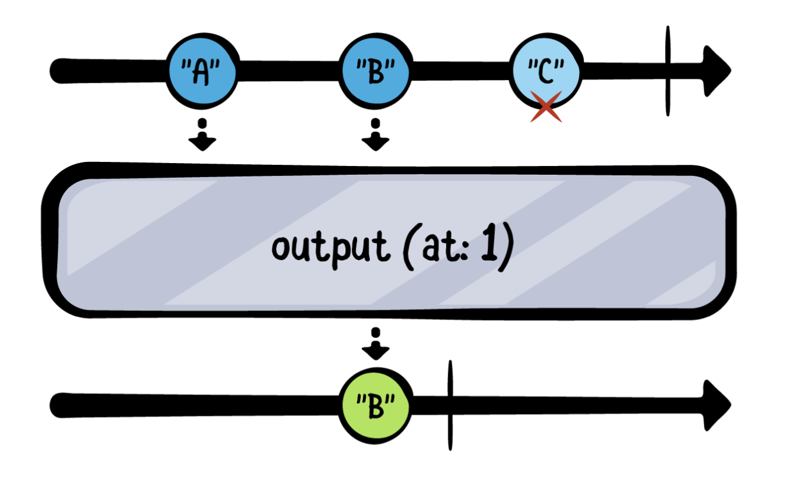
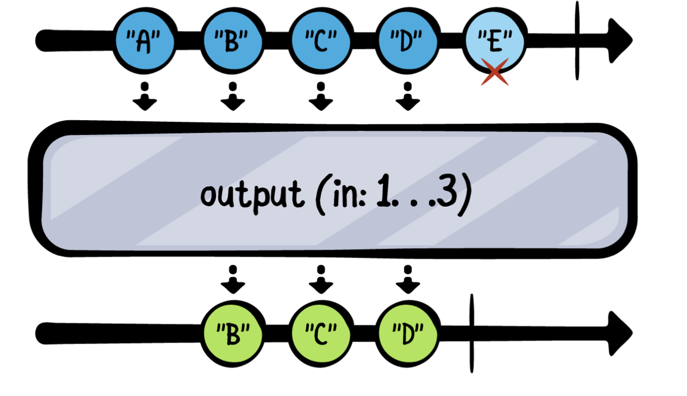
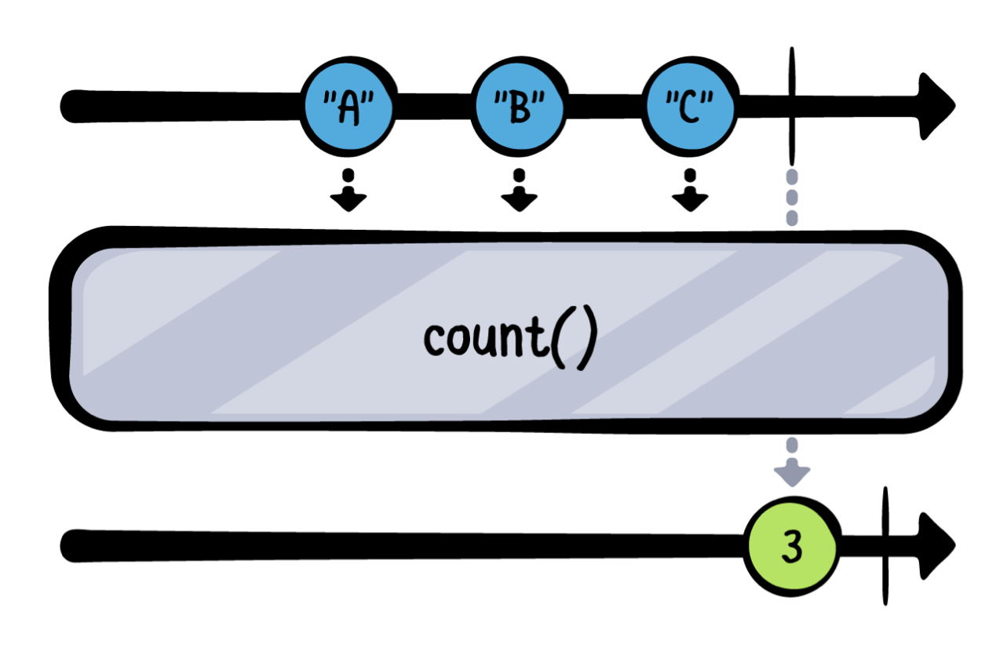
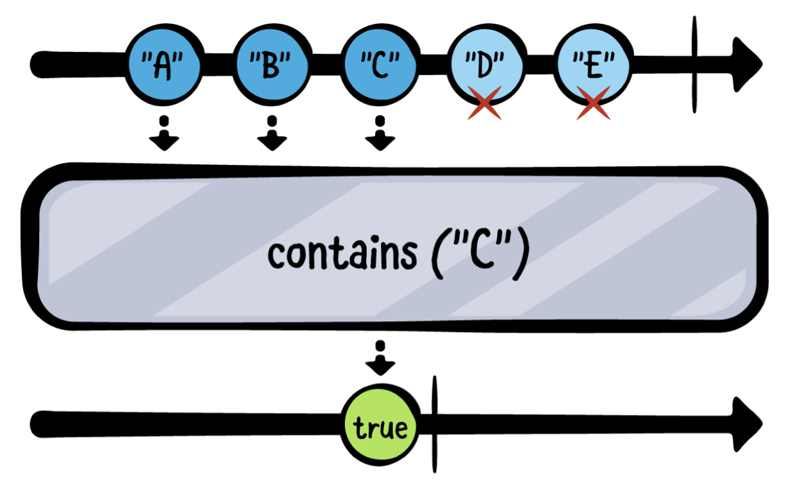
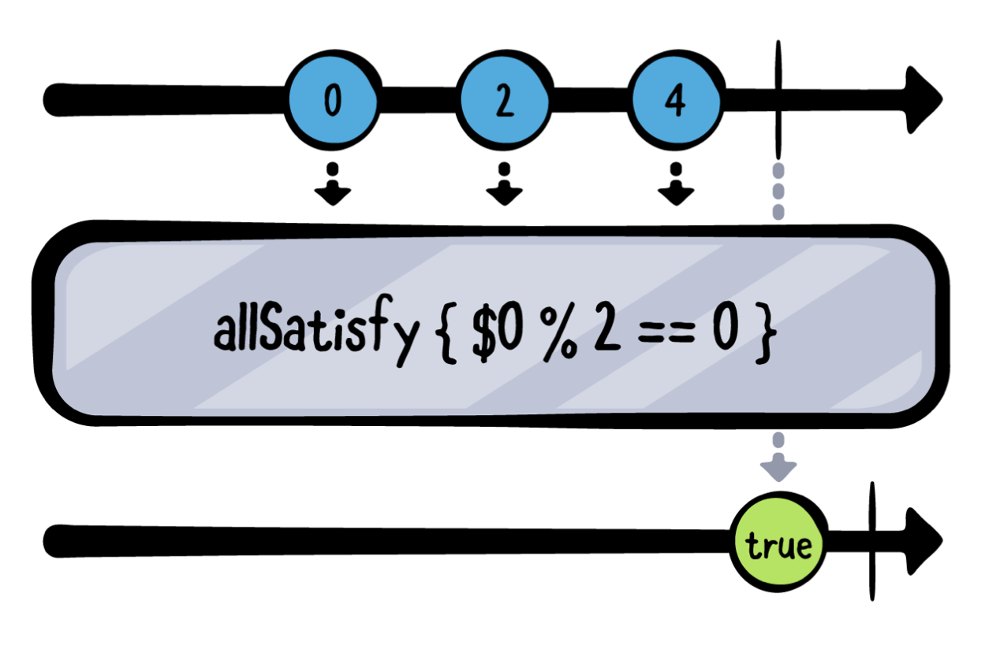
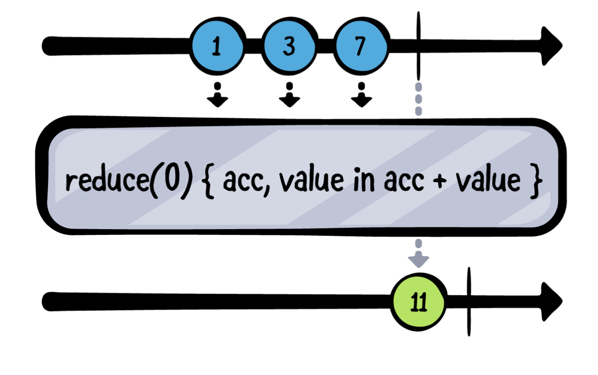

# Ch 7: Sequence Operators


### Finding values

첫 섹션은 publisher가 서로 다른 기준으로 방출된 값들을 찾는 Operators에 대해서 알아봅니다.

#### min

- greedy하게 동작함
- publisher가 반드시 `.finished`로 completion event를 보내야함.

- value가 `Comparable`을 준수
- value가 Comparable을 준수하지 않더라도, `min(by:)` 를 사용해서 커스텀하게 쓸 수 있다.
- min 예제코드
- min(by:) 예제코드

#### max

- min과 같음.

#### first

- Swift의 first와 같은 동작
- lazy하게 동작
- publisher가 finish되는걸 기다릴 필요가 없다.
- 첫번째 값을 받으면 구독이 취소된다.
- 예제코드
- first(where): 예제코드

#### last

- first의 반대되는 오퍼레이터
-  greedy하게 동작
- publisher가 .finish로 completion 되는걸 기다린다.
- upstream이 반드시 finish를 해야된다.

#### output(at:)

- upstream에서 특정 인덱스에 해당하는 value를 내려보낸다.
- 예제 코드



```swift
example(of: "output(at:)") {
    let publisher = ["A", "B", "C"].publisher
    
    publisher
        .print("publisher")
        .output(at: 1)
        .sink(receiveValue: { print("Value at index 1 is \($0)") })
        .store(in: &subscriptions)
}
/*
——— Example of: output(at:) ———
publisher: receive subscription: (["A", "B", "C"])
publisher: request unlimited
publisher: receive value: (A)
publisher: request max: (1) (synchronous)
publisher: receive value: (B)
Value at index 1 is B
publisher: receive cancel
*/
```

- Output에 대해
  - 특정 인덱스에 해당하는 아이템을 찾으려고 하기 때문에, 오퍼레이터가 value를 방출한 다음에 1 more value를 demand하는걸 볼 수 있다. (값을 하나씩)
  - 이를 통해 애플이 Combine의 오퍼레이터를 어떻게 디자인하는지 엿볼 수 있다.


#### output(in:)

- output(at)의 Range 버젼



- 코드 예제


### Querying the publisher

#### count

- finish되기 전까지 몇개의 value가 emit됐는지 방출한다.
- 예제코드



#### contains

- contains operator는 true를 방출하고 구독을 취소한다.



- lazy하게 동작
- 예제 코드

#### allSatisfy

- 방출된 모든 value가 조건을 만족하는지
- greedy
- upstream publisher가 .finished completion이 방출될 때까지 기다린다.



- 예제코드
- 중간에 조건에 만족하지 않은 값이 내려오게 되면 false를 방출하고 구독이 취소된다.


#### reduce



```swift
example(of: "reduce") {
    let publisher = ["Hel", "lo", " ", "Wor", "ld", "!"].publisher
    
    publisher
        .print("publisher")
            .reduce("") { accumulator, value in
                accumulator + value
        }
        .sink(receiveValue: { print("Reduced into: \($0)") })
        .store(in: &subscriptions)
}
/*
——— Example of: reduce ———
publisher: receive subscription: (["Hel", "lo", " ", "Wor", "ld", "!"])
publisher: request unlimited
publisher: receive value: (Hel)
publisher: receive value: (lo)
publisher: receive value: ( )
publisher: receive value: (Wor)
publisher: receive value: (ld)
publisher: receive value: (!)
publisher: receive finished
Reduced into: Hello World!
*/
```

- Reduced into: 가 한번만 찍힌걸 볼 수 있다. (upstream에서 .finished completion 이벤트가 발생했을 때)
- 