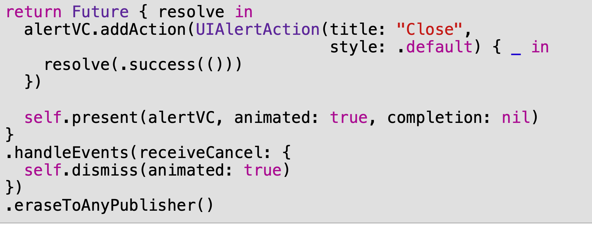

- **PhotoWriter** - 유저의 콜라쥬를 disk에 저장해준다.
  - 비동기로 이미지를 디스크에 저장하고 future를 반환한다.
- `PHPhotoLibrary.shared().performChangesAndWait` : 사진 앨범에 동기적으로 접근.
- Future의 생성 클로져는 asynchronously하게 실행되기 때문에 main thread block 걱정을 할 필요 없음.


### A note on memory management

- 클로저 캡쳐에 대해서 weak, unowned 때문에 고생하지 말고 struct를 써라.
- 하지만 UI코드, 특히 UIKit/AppKit 관련 코드를 다룰 땐 항상 UIViewController같은 클래스를 사용하게 된다.
- Combinezhemfmf 작성할 때도 동일한 규칙이 적용되기 때문에 Swift capture semantics랑 항상 같은 의미로 사용해야 된다.
  - 메모리로부터 해제될 수 있는 객체에 대해 캡쳐를 했다면(예제에서 PhotosViewController를 띄웠던거첢), 이런 경우 `[weak self]`를 self를 사용하기보단 다른 변수를 사용해야한다.
  - 현재 예시의 MainViewController와 같은 경우 - 메모리에서 해제되지 않을 객체에 대해 캡쳐를 했다면 `[unowned self]`를 안전하게 사용할 수 있다. 


## Publishing properties with @Published

- Wrapper는 구문 표시를 선언에 추가하여 동작을 타입프로퍼티에 추가할 수 있는 문법

- `@Published`  : publisher를 자동으로 추가하게 해준다. (값이 변경될 때마다)

```swift
// syntax
struct Person {
  @Published var age: Int = 0
}

```

- 컴파일러가 자동으로 같은 접근수준의(private, public) `$age` 를 생성해준다.
  - `$age`는 에러를 뱉지 않는 publisher. 프로퍼티를 변경할 때마다 `$age`가 새로운 value 를 emit 한다.

> Note: @Published는 초기값을 요구한다. 


### Discussion

- unowned를 안전하게 사용하고 있다고 꼬드기다니..


- 

여기서 handleEvents에서 self.dismisss 할 때는 weak 안해줘도될까요


- share했을 땐 finish뒤에 cancel이 안오는데, share를 안하면 finish뒤에 cancel이 온다?

